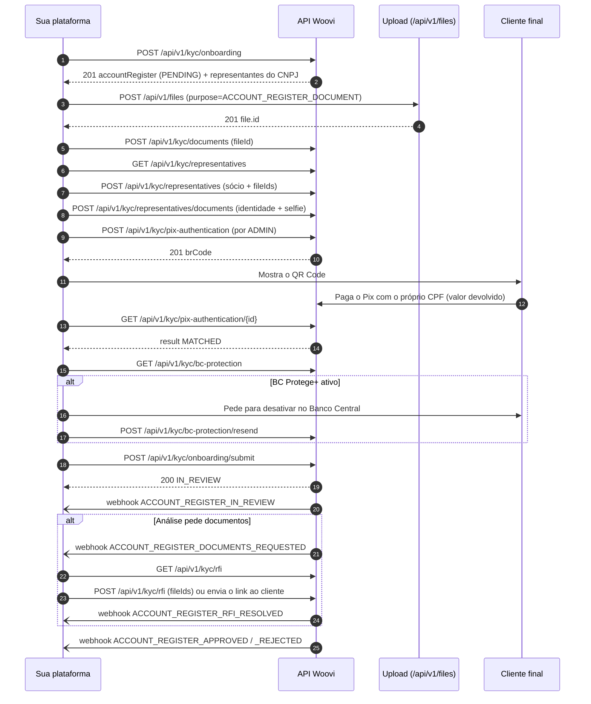

O [link de onboarding](./api-onboarding-create.mdx) é o caminho mais curto: você cria o onboarding e o seu cliente preenche tudo numa página hospedada pela Woovi. Quando você já tem o seu próprio funil — coleta os documentos, a selfie e os dados dos sócios dentro do seu produto — dá para fazer **o onboarding inteiro pela API**, sem que o cliente final veja nenhuma tela da Woovi.

Esta página descreve esse fluxo de ponta a ponta. Todos os endpoints endereçam o cadastro pelo mesmo `correlationID` que você enviou ao criar o onboarding.

:::info Pré-requisitos
- Empresa com a feature **BAAS** (ou **PARTNER**) habilitada; para criar o onboarding, também **KYC_ONBOARDING_LINK**.
- Um AppID com os escopos da [tabela de escopos](#escopos) abaixo. Veja [Primeiros passos com a API de KYC Onboarding](./api-getting-started.mdx) e [Adicionando escopos ao seu AppID](../../apis/api-scopes.md).
- Se a sua integração ainda não segue o padrão de upload + `fileId`, webhooks e idempotência, leia antes [Como construir integrações 100% via API com a Woovi](../../apis/api-driven-integrations.md).
:::

## Link hospedado ou API pura?

| | Link hospedado | 100% via API |
| --- | --- | --- |
| Quem coleta documentos e selfie | A Woovi, na página do link | Você, no seu produto |
| Esforço de integração | Uma chamada + webhooks | Um endpoint por passo + upload de arquivos |
| Pix de autenticação e BC Protege+ | O link conduz o cliente | Você mostra o QR Code e orienta o cliente |
| Envio para análise | O cliente clica em enviar | Você chama `POST /api/v1/kyc/onboarding/submit` |
| RFI (pedido de documentos) | O cliente responde no link | Você responde pela API **ou** envia o link da RFI |

Os dois caminhos gravam no mesmo cadastro e passam pelas mesmas validações, então dá para misturar: criar pela API, enviar os documentos que você já tem e mandar o link só para o que faltar. Na dúvida, comece pelo link; migre para a API quando a experiência dentro do seu produto justificar.

## Visão geral



## Escopos

| Endpoint | Escopo |
| --- | --- |
| `POST /api/v1/kyc/onboarding` | `KYC_ONBOARDING_POST` |
| `POST /api/v1/files` | `FILE_POST` |
| `GET /api/v1/kyc/documents` | `KYC_DOCUMENTS_GET` |
| `POST /api/v1/kyc/documents` | `KYC_DOCUMENTS_POST` |
| `GET /api/v1/kyc/representatives` | `KYC_REPRESENTATIVES_GET` |
| `POST /api/v1/kyc/representatives` e `/representatives/documents` | `KYC_REPRESENTATIVES_POST` |
| `POST /api/v1/kyc/pix-authentication` | `KYC_PIX_AUTHENTICATION_POST` |
| `GET /api/v1/kyc/pix-authentication/{id}` | `KYC_PIX_AUTHENTICATION_GET` |
| `GET /api/v1/kyc/bc-protection` | `KYC_BC_PROTECTION_GET` |
| `POST /api/v1/kyc/bc-protection/resend` | `KYC_BC_PROTECTION_POST` |
| `POST /api/v1/kyc/onboarding/submit` | `KYC_ONBOARDING_SUBMIT_POST` |
| `GET /api/v1/kyc/rfi` | `KYC_RFI_GET` |
| `POST /api/v1/kyc/rfi` | `KYC_RFI_POST` |

Sem o escopo, a chamada responde `403`.

## Status do cadastro

| Status | O que significa | O que a API aceita |
| --- | --- | --- |
| `DRAFT` / `PENDING` | Aguardando você (ou o cliente) | Tudo: documentos, sócios, Pix, BC Protege+, submit |
| `IN_REVIEW` | Em análise na Woovi | Só leitura, exceto enquanto houver RFI aberta |
| `APPROVED` | Conta aprovada e provisionada | Só leitura |
| `REJECTED` | Reprovado | Só leitura |

`IN_REVIEW` não é final: a análise pode abrir uma RFI ou devolver o cadastro para `PENDING`. Veja [Como acompanhar o onboarding em tempo real por webhooks](./webhooks-ciclo-de-vida.mdx).

## 1. Criar o onboarding

```bash
curl -X POST https://api.woovi.com/api/v1/kyc/onboarding \
  -H "Authorization: <APP_ID>" \
  -H "Content-Type: application/json" \
  -d '{
    "taxID": "11.222.333/0001-81",
    "correlationID": "merchant-4417",
    "businessDescription": "Venda de roupas e acessorios pela internet",
    "website": "https://loja-do-merchant.com.br"
  }'
```

O cadastro nasce em `PENDING`, já com os sócios encontrados no CNPJ (`source: ENRICHMENT`). A chamada é idempotente por `correlationID`: repetir devolve o mesmo cadastro (`200`). Os campos estão em [Como criar um onboarding KYC via API?](./api-onboarding-create.mdx).

A partir daqui, todo endpoint recebe `correlationID` (no body ou na query). O CNPJ do cadastro também é aceito no lugar dele.

## 2. Subir os arquivos e obter o `fileId`

Nenhum endpoint de KYC recebe o arquivo em si. Primeiro você sobe cada arquivo no [endpoint de arquivos](../../arquivos/upload-de-arquivo.md) com `purpose=ACCOUNT_REGISTER_DOCUMENT`; depois envia o `id` devolvido como `fileId`.

```bash
curl -X POST https://api.woovi.com/api/v1/files \
  -H "Authorization: <APP_ID>" \
  -F "file=@contrato-social.pdf" \
  -F "purpose=ACCOUNT_REGISTER_DOCUMENT" \
  -F "correlationID=merchant-4417-contrato-social"
```

```json
{
  "file": {
    "id": "6712c2ac7c2f1e0012a4b8d1",
    "purpose": "ACCOUNT_REGISTER_DOCUMENT",
    "fileName": "contrato-social.pdf",
    "contentType": "application/pdf"
  }
}
```

:::caution Regras do `fileId`
- O arquivo precisa ter sido enviado **pela mesma empresa** do AppID e com `purpose` **`ACCOUNT_REGISTER_DOCUMENT`**. Arquivo de outra empresa ou de outro `purpose` responde como não encontrado (`400`).
- Formatos aceitos: PDF, PNG, JPEG e WEBP, até 10 MiB. HEIC não é aceito.
- Um mesmo `fileId` não pode aparecer duas vezes na mesma requisição.
- Todos os `fileId` são resolvidos **antes** de gravar: se um falhar, nada da requisição é gravado.
:::

## 3. Documentos da empresa

```bash
curl -X POST https://api.woovi.com/api/v1/kyc/documents \
  -H "Authorization: <APP_ID>" \
  -H "Content-Type: application/json" \
  -d '{
    "correlationID": "merchant-4417",
    "documents": [
      { "type": "SOCIAL_CONTRACT", "fileId": "6712c2ac7c2f1e0012a4b8d1" }
    ]
  }'
```

Tipos aceitos: `SOCIAL_CONTRACT`, `CCMEI`, `ATA`, `BYLAWS`, `BETS_LICENSE`, `BANK_STATEMENT`, `FINANCIAL_CAPACITY_PROOF`, `BILLING_PROOF`, `COMPANY_ADDRESS_PROOF`. De 1 a 10 por chamada.

A resposta `201` lista todos os documentos da empresa (com `url` de download válida por 5 minutos) e `requestDocuments`, os tipos que a análise ainda espera. `GET /api/v1/kyc/documents?correlationID=merchant-4417` devolve o mesmo formato.

## 4. Sócios e representantes

Liste os sócios que já vieram do CNPJ e guarde o `id` de cada um — é por ele, **nunca pelo CPF**, que os outros endpoints endereçam um sócio (um CPF pode aparecer duas vezes quando um sócio foi desativado e substituído).

```bash
curl "https://api.woovi.com/api/v1/kyc/representatives?correlationID=merchant-4417" \
  -H "Authorization: <APP_ID>"
```

Para adicionar um sócio (só enquanto o cadastro estiver `DRAFT`/`PENDING`), já com os documentos:

```bash
curl -X POST https://api.woovi.com/api/v1/kyc/representatives \
  -H "Authorization: <APP_ID>" \
  -H "Content-Type: application/json" \
  -d '{
    "correlationID": "merchant-4417",
    "name": "MARIA DE SOUZA",
    "taxID": "529.982.247-25",
    "type": "ADMIN",
    "birthDate": "1985-03-14",
    "email": "maria@exemplo.com",
    "phone": "+5511999999999",
    "documents": [
      { "type": "CNH", "fileId": "6712c2ac7c2f1e0012a4b8d2" },
      { "type": "PICTURE", "fileId": "6712c2ac7c2f1e0012a4b8d3" }
    ]
  }'
```

- `type: ADMIN` (padrão) é o administrador: **deve** a autenticação Pix, a liberação do BC Protege+, a selfie e um documento de identidade. `REPRESENTATIVE` não.
- CPF já ativo no cadastro → `409 REPRESENTATIVE_ALREADY_REGISTERED`. CPF de um sócio desativado → a linha é reativada (`200`, `reactivated: true`). MEI tem um único titular (`409 MEI_SINGLE_OWNER`).
- Um arquivo reprovado pela checagem de qualidade (ilegível, cortado) volta em `rejectedDocuments` e pode ser reenviado.

Para enviar documentos de um sócio que já existe (por exemplo, os que vieram do CNPJ):

```bash
curl -X POST https://api.woovi.com/api/v1/kyc/representatives/documents \
  -H "Authorization: <APP_ID>" \
  -H "Content-Type: application/json" \
  -d '{
    "correlationID": "merchant-4417",
    "representativeId": "6721f0b3c1d4e80012a4f9aa",
    "documents": [
      { "type": "IDENTITY_FRONT", "fileId": "6712c2ac7c2f1e0012a4b8d4" },
      { "type": "IDENTITY_BACK", "fileId": "6712c2ac7c2f1e0012a4b8d5" },
      { "type": "PICTURE", "fileId": "6712c2ac7c2f1e0012a4b8d6" }
    ]
  }'
```

Todo ADMIN ativo precisa de `PICTURE` (selfie) **e** de uma identidade válida: `CNH`, ou `CNH_FRONT` + `CNH_BACK`, ou `IDENTITY_FRONT` + `IDENTITY_BACK`, ou `PASSPORT`. Se todos os arquivos forem reprovados, a resposta é `422`.

## 5. Autenticação Pix dos administradores

Quando a sua empresa tem a feature `PIX_AUTHENTICATION_KYC`, cada ADMIN ativo precisa provar que tem conta no próprio CPF pagando um Pix de valor simbólico. A cobrança é criada com `ensureSameTaxID`: o próprio arranjo Pix recusa pagador com outro CPF. O valor é devolvido.

```bash
curl -X POST https://api.woovi.com/api/v1/kyc/pix-authentication \
  -H "Authorization: <APP_ID>" \
  -H "Content-Type: application/json" \
  -d '{
    "correlationID": "merchant-4417",
    "representativeId": "6721f0b3c1d4e80012a4f9aa"
  }'
```

```json
{
  "pixAuthentication": {
    "id": "6722a1d0e4b1f30012c0ffee",
    "status": "CREATED",
    "result": "UNVERIFIED",
    "amount": 1,
    "dueDate": "2026-09-24T18:30:00.000Z"
  },
  "brCode": "00020101021226900014br.gov.bcb.pix..."
}
```

Mostre o `brCode` como QR Code ou "copia e cola" para o sócio. Chamar de novo com uma cerimônia aberta devolve o **mesmo** `brCode`; se o sócio já estiver verificado, a resposta é `200` com `result: MATCHED` e sem `brCode`. Não fixe o `amount` no seu código: ele muda por ambiente.

Depois, consulte o resultado:

```bash
curl https://api.woovi.com/api/v1/kyc/pix-authentication/6722a1d0e4b1f30012c0ffee \
  -H "Authorization: <APP_ID>"
```

| `result` | Significado | Próximo passo |
| --- | --- | --- |
| `UNVERIFIED` | Nenhum pagamento ainda | Continue consultando até `dueDate` |
| `MATCHED` | Pagador = CPF do sócio | Pronto para esse sócio |
| `MISMATCH` | Pagou, mas outro CPF / instituição reprovada | Crie uma nova cerimônia |

Decida por `result`, não por `status`. Cadência sugerida: a cada 5 s, recuando para 10, 20 e 40 s em erros seguidos. Quando `allRepresentativesVerified` for `true`, todos os ADMIN estão verificados.

:::note Sandbox
No sandbox a cerimônia não pode ser concluída (exige um Pix real), então essa exigência não se aplica lá.
:::

## 6. BC Protege+

O [BC Protege+](https://www.bcb.gov.br/meubc/bcprotege) é um cadastro do Banco Central em que o titular bloqueia a abertura de contas no próprio nome. Enquanto estiver ativo para o CNPJ ou para algum ADMIN ativo, a Woovi não pode abrir a conta.

```bash
curl "https://api.woovi.com/api/v1/kyc/bc-protection?correlationID=merchant-4417" \
  -H "Authorization: <APP_ID>"
```

```json
{
  "applicable": true,
  "authorized": false,
  "blocking": [
    { "scope": "REPRESENTATIVE", "taxID": "52998224725", "situation": "UNAUTHORIZED" }
  ]
}
```

- `applicable: false` → a regra não se aplica à sua empresa; nunca bloqueia.
- `blocking` lista **todos** os bloqueios de uma vez; mostre todos ao cliente.
- Só o titular resolve: ele desativa o BC Protege+ no Banco Central e você pede uma nova consulta:

```bash
curl -X POST https://api.woovi.com/api/v1/kyc/bc-protection/resend \
  -H "Authorization: <APP_ID>" \
  -H "Content-Type: application/json" \
  -d '{ "correlationID": "merchant-4417", "taxID": "52998224725" }'
```

A resposta `202` significa que a consulta foi aceita, não que a situação mudou: leia o `GET` de novo depois (ou espere o webhook `ACCOUNT_REGISTER_STEP_UPDATED`). Há um limite de um reenvio por hora por CPF/CNPJ: dentro da janela a resposta é `429` com `nextResendAt`.

## 7. Enviar para análise

```bash
curl -X POST https://api.woovi.com/api/v1/kyc/onboarding/submit \
  -H "Authorization: <APP_ID>" \
  -H "Content-Type: application/json" \
  -d '{ "correlationID": "merchant-4417" }'
```

```json
{
  "correlationID": "merchant-4417",
  "status": "IN_REVIEW",
  "inReviewAt": "2026-09-24T16:10:00.000Z"
}
```

- Só é aceito para cadastros em `DRAFT` ou `PENDING`. Cadastros em qualquer outro status (`APPROVED`, `REJECTED`…) são recusados.
- É idempotente: um cadastro que já está `IN_REVIEW` responde `200` com o `inReviewAt` original, sem refazer nada. Pode repetir uma chamada que deu timeout.
- Todas as validações rodam no servidor. Enquanto alguma estiver pendente, a resposta é `409` com `code`:

| `code` | Causa | Como resolver |
| --- | --- | --- |
| `MISSING_PIX_AUTHENTICATION` | Um ADMIN ativo sem cerimônia `MATCHED` (só com `PIX_AUTHENTICATION_KYC`) | [Passo 5](#5-autenticação-pix-dos-administradores) |
| `BC_PROTECTION_NOT_AUTHORIZED` | CNPJ ou ADMIN com BC Protege+ ativo | [Passo 6](#6-bc-protege) |
| `MISSING_REPRESENTATIVE_DOCUMENTS` | ADMIN sem selfie ou sem identidade válida | [Passo 4](#4-sócios-e-representantes) |
| `PENDING_REQUESTED_DOCUMENTS` | A análise pediu documentos que não foram enviados | [Passo 3](#3-documentos-da-empresa) / [RFI](#9-rfi-pedido-de-informações) |
| `PENDING_BC_PROTEGE` | A única pendência é o BC Protege+ | [Passo 6](#6-bc-protege) |

:::info Diferença para o link
No link hospedado a autenticação Pix não impede o envio (ela é cobrada depois, na análise). Pela API ela bloqueia o submit, porque a sua integração não tem uma "próxima tela" para mandar o cliente de volta.
:::

## 8. Acompanhar por webhook

Não faça _polling_ do status. Cadastre os webhooks com a sua **API Master**:

| Evento | Quando |
| --- | --- |
| `ACCOUNT_REGISTER_STEP_UPDATED` | Um passo foi concluído ou bloqueado (ex.: BC Protege+) |
| `ACCOUNT_REGISTER_IN_REVIEW` | O cadastro entrou em análise |
| `ACCOUNT_REGISTER_DOCUMENTS_REQUESTED` | A análise abriu uma RFI |
| `ACCOUNT_REGISTER_RFI_RESOLVED` | Todos os itens da RFI foram respondidos |
| `ACCOUNT_REGISTER_PENDING` | O cadastro voltou para o cliente |
| `ACCOUNT_REGISTER_APPROVED` / `_REJECTED` | Decisão final |

Payloads, assinatura e deduplicação estão em [Como acompanhar o onboarding em tempo real por webhooks?](./webhooks-ciclo-de-vida.mdx).

## 9. RFI (pedido de informações)

Quando a análise precisa de algo a mais, ela abre uma RFI e envia `ACCOUNT_REGISTER_DOCUMENTS_REQUESTED`. Leia o que foi pedido:

```bash
curl "https://api.woovi.com/api/v1/kyc/rfi?correlationID=merchant-4417" \
  -H "Authorization: <APP_ID>"
```

```json
{
  "rfi": {
    "status": "OPEN",
    "kind": "DOCUMENTS",
    "reason": "Enviar contrato social atualizado e documento do sócio",
    "requestedAt": "2026-09-24T17:00:00.000Z",
    "deadlineAt": "2026-10-01T17:00:00.000Z"
  },
  "company": {
    "pending": [
      { "type": "SOCIAL_CONTRACT", "answeredBy": "FILE" },
      { "type": "WEBSITE", "answeredBy": "LINK" }
    ]
  },
  "representatives": [
    {
      "id": "6721f0b3c1d4e80012a4f9aa",
      "name": "MARIA DE SOUZA",
      "pending": [
        { "type": "CNH", "answeredBy": "FILE" },
        { "type": "PIX_AUTHENTICATION", "answeredBy": "PIX_AUTHENTICATION" }
      ]
    }
  ],
  "link": "https://kyc.woovi.com/rfi/QWNjb3VudFJlZ2lzdGVyOjY5..."
}
```

`answeredBy` diz como responder cada item:

| `answeredBy` | Como responder |
| --- | --- |
| `FILE` | `POST /api/v1/kyc/rfi` (ou os endpoints de documentos) |
| `PIX_AUTHENTICATION` | [Passo 5](#5-autenticação-pix-dos-administradores) |
| `BC_PROTECTION` | [Passo 6](#6-bc-protege), depois que o cliente desativar |
| `LINK` | Só pelo `link` (site, descrição do negócio, regularização do CNPJ) |

Responda os arquivos numa única chamada:

```bash
curl -X POST https://api.woovi.com/api/v1/kyc/rfi \
  -H "Authorization: <APP_ID>" \
  -H "Content-Type: application/json" \
  -d '{
    "correlationID": "merchant-4417",
    "documents": [
      { "type": "SOCIAL_CONTRACT", "fileId": "6712c2ac7c2f1e0012a4b8d7" }
    ],
    "representatives": [
      {
        "representativeId": "6721f0b3c1d4e80012a4f9aa",
        "documents": [{ "type": "CNH", "fileId": "6712c2ac7c2f1e0012a4b8d8" }]
      }
    ]
  }'
```

Cada arquivo precisa responder a um item que foi pedido — senão `400 NOT_REQUESTED` e nada é gravado. Um pedido de identidade de sócio aceita qualquer família (`CNH`, `CNH_FRONT`/`CNH_BACK`, `IDENTITY_FRONT`/`IDENTITY_BACK`, `PASSPORT`). Sem RFI aberta, a resposta é `409 RFI_NOT_OPEN`. Quando nada mais estiver pendente, a RFI fecha (`status: RESOLVED`) e chega o webhook `ACCOUNT_REGISTER_RFI_RESOLVED`.

Você pode misturar: responder os arquivos pela API e mandar o `link` ao cliente só para os itens `LINK`.

## Erros comuns

Todas as respostas de erro têm `error` (mensagem já traduzida) e, quando existe, `code` (estável, use no seu código).

| HTTP | `code` | Causa |
| --- | --- | --- |
| `400` | — | Body inválido (lista de erros de validação), CPF inválido, ou `fileId` não encontrado para a sua empresa/`purpose` |
| `400` | `NOT_REQUESTED` | Arquivo de RFI que não responde a nada pedido |
| `401` | — | AppID ausente ou inválido |
| `403` | — | Empresa sem BAAS/PARTNER, sem `PIX_AUTHENTICATION_KYC` (Pix), ou AppID sem o escopo |
| `404` | — | Nenhum cadastro com esse `correlationID` na sua empresa, ou sócio desconhecido |
| `409` | `ACCOUNT_REGISTER_NOT_OPEN` | O cadastro não aceita mais alterações no status atual |
| `409` | `REPRESENTATIVE_ALREADY_REGISTERED` / `MEI_SINGLE_OWNER` | Sócio duplicado / MEI com mais de um titular |
| `409` | `REPRESENTATIVE_NOT_ACTIVE` | Documento para um sócio desativado |
| `409` | `REGISTER_CLOSED_FOR_NEW_CEREMONIES` | Cadastro fora de `PENDING` sem RFI de Pix aberta |
| `409` | códigos do [submit](#7-enviar-para-análise) | Alguma validação do envio pendente |
| `409` | `RFI_NOT_OPEN` | Não há RFI aberta |
| `422` | — | Todos os documentos do sócio foram reprovados na checagem de qualidade |
| `429` | — | Reenvio do BC Protege+ dentro da janela de 1 hora (`nextResendAt`) |
| `502` | `UPSTREAM_ERROR` | Serviço de autenticação Pix indisponível; tente de novo |

:::tip Referência completa
Schemas, parâmetros e exemplos interativos de cada endpoint estão na [API Reference](/api#tag/kyc).
:::
