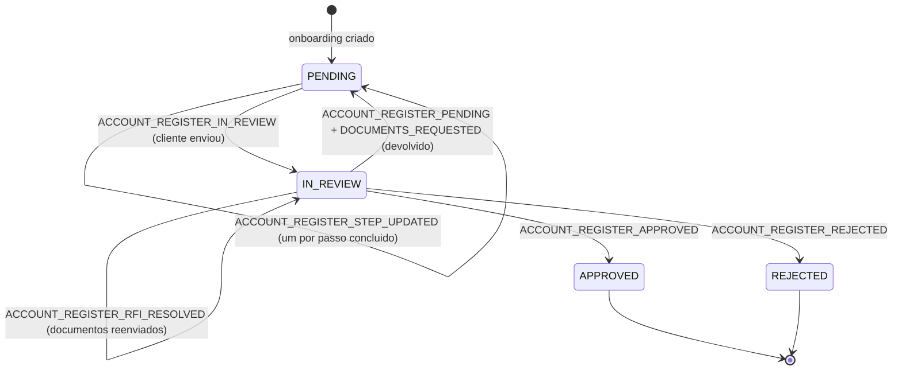

Entre "criei o link de onboarding" e "a conta foi aprovada" existe um processo de vários passos que pode durar dias: o seu cliente final preenche os dados da empresa, sobe o contrato social, cadastra os sócios, faz a selfie, autoriza o BC Protege+ e assina os termos — e, no meio disso, pode ser que a análise peça um documento novo e devolva o cadastro para ele.

Em vez de fazer _polling_ no [`GET /api/v1/account-register/:id`](./api-account-register-get.mdx), você pode receber cada uma dessas transições por webhook. Esta página descreve **todos** os eventos do ciclo de vida, o que vem em cada payload e como montar, do seu lado, uma visão de "onde esse cliente parou e ele já tentou de novo?".

:::info
Os eventos `ACCOUNT_REGISTER_*` pertencem à **API Master** (a credencial BaaS que criou o onboarding), e não ao AppID da subconta — a subconta ainda nem existe quando eles começam a ser emitidos. Veja [Webhooks por conta](../webhooks-por-conta.md).
:::

## Visão geral do ciclo



O ponto importante: **`IN_REVIEW` não é um estado final**. Um cadastro pode entrar em análise, voltar para `PENDING` porque faltou um documento, ser reenviado e entrar em análise de novo — quantas vezes for necessário. Todo evento carrega um contador (`retryCount`) exatamente para você saber em qual dessas voltas está.

## Os eventos

| Evento | Dispara quando | Tem `step`? |
| --- | --- | --- |
| `ACCOUNT_REGISTER_STEP_UPDATED` | o cliente conclui **um passo** do onboarding — ou o BC Protege+ bloqueia um | sim |
| `ACCOUNT_REGISTER_IN_REVIEW` | o cadastro entra em análise (envio do cliente **ou** promoção por um operador) | não |
| `ACCOUNT_REGISTER_DOCUMENTS_REQUESTED` | a análise pede documentos novos (RFI) | não |
| `ACCOUNT_REGISTER_RFI_RESOLVED` | o cliente respondeu a todos os documentos pedidos | não |
| `ACCOUNT_REGISTER_PENDING` | o cadastro volta para o cliente com pendências | não |
| `ACCOUNT_REGISTER_APPROVED` | KYC aprovado e conta provisionada | não |
| `ACCOUNT_REGISTER_REJECTED` | KYC reprovado | não |

:::tip Um evento por passo, não um evento por nome de passo
Existe **um único** evento para os onze passos do onboarding: `ACCOUNT_REGISTER_STEP_UPDATED`, com o passo dentro do payload. Um `Webhook` casa com **uma** string de evento, então um nome por passo obrigaria você a cadastrar a mesma URL onze vezes — onze linhas no console, onze segredos HMAC para rotacionar. Você faz um `switch` no campo `step` e resolve com um `if`.
:::

## Registrando os webhooks

```bash
curl --request POST \
  --url https://api.woovi.com/api/v1/webhook \
  --header 'Authorization: <SUA_API_MASTER>' \
  --header 'Content-Type: application/json' \
  --data-raw '{
    "webhook": {
      "name": "onboarding - passos",
      "event": "ACCOUNT_REGISTER_STEP_UPDATED",
      "url": "https://minhaurl.exemplo/webhook/kyc",
      "authorization": "meu-token-de-verificacao",
      "isActive": true
    }
  }'
```

Repita para cada evento que você quer receber. A lista completa e sempre atualizada está em `GET /api/v1/webhook/events`.

No cadastro a Woovi faz um _handshake_: sua URL recebe um POST de teste e precisa responder `200` (use `?validate=false` para pular). A resposta traz o `hmacSecretKey` da assinatura.

## Envelope e assinatura

Todos os eventos chegam no mesmo formato, com o nome do evento no corpo:

```json
{
  "event": "ACCOUNT_REGISTER_STEP_UPDATED",
  "accountRegister": { "...": "..." }
}
```

E com os mesmos _headers_ de assinatura de qualquer webhook da Woovi:

| Header | O que é |
| --- | --- |
| `x-webhook-signature` | assinatura RSA-SHA256 em base64, feita com a chave privada da Woovi — **use esta** ([como validar](../../webhook/seguranca/webhook-signature-validation.mdx)) |
| `x-openpix-signature` | HMAC-SHA1 em base64 com o `hmacSecretKey` do seu webhook ([como validar](../../webhook/seguranca/webhook-hmac.mdx)) |

## `ACCOUNT_REGISTER_STEP_UPDATED`

O evento de progresso. Um disparo por passo concluído, na hora em que o passo é concluído.

### Payload

```json
{
  "event": "ACCOUNT_REGISTER_STEP_UPDATED",
  "accountRegister": {
    "accountRegisterId": "66f0c2a1d4b2f10012ab34cd",
    "correlationID": "my-unique-id",
    "taxID": { "taxID": "12345678000199", "type": "BR:CNPJ" },
    "officialName": "EMPRESA EXEMPLO LTDA",
    "status": "PENDING",
    "completedSteps": ["COMPANY_DATA", "ADDRESS"],
    "pendingSteps": ["SOCIAL_CONTRACT", "PARTNERS", "TERMS", "REVIEW"],
    "step": "ADDRESS",
    "stepStatus": "COMPLETED",
    "stepScope": "COMPANY",
    "stepCompletedAt": "2026-09-04T14:02:11.482Z",
    "retrying": false,
    "retryCount": 0
  }
}
```

| Campo | Descrição |
| --- | --- |
| `accountRegisterId` | id do registro de conta na Woovi |
| `correlationID` | o seu identificador, informado na criação do onboarding |
| `status` | status do cadastro **no momento do evento** (`PENDING`, `IN_REVIEW`, …) |
| `completedSteps` | todos os passos de **empresa** já concluídos, acumulado |
| `pendingSteps` | os passos de empresa que ainda faltam para este cadastro |
| `step` | o passo que acabou de mudar (nome público, veja a tabela abaixo) |
| `stepStatus` | `COMPLETED` ou `BLOCKED` |
| `stepScope` | `COMPANY` ou `REPRESENTATIVE` |
| `stepCompletedAt` | quando o passo mudou (ISO 8601) |
| `retrying` / `retryCount` | veja [O cliente está tentando de novo?](#o-cliente-está-tentando-de-novo) |
| `representative` | presente quando `stepScope` é `REPRESENTATIVE` |
| `bcProtection` | presente quando o BC Protege+ bloqueia |

### Os passos

| `step` | `stepScope` | Concluído quando |
| --- | --- | --- |
| `COMPANY_DATA` | `COMPANY` | dados da empresa preenchidos |
| `ADDRESS` | `COMPANY` | endereço da empresa preenchido |
| `SOCIAL_CONTRACT` | `COMPANY` | contrato social (ou CCMEI, para MEI) enviado |
| `PARTNERS` | `COMPANY` | quadro societário completo e válido |
| `BC_PROTEGE` | `COMPANY` ou `REPRESENTATIVE` | autorização do BC Protege+ liberada |
| `TERMS` | `COMPANY` | termos aceitos |
| `REPRESENTATIVE_DOCUMENTS` | `REPRESENTATIVE` | documento de identidade do sócio enviado |
| `REPRESENTATIVE_FACEMATCH` | `REPRESENTATIVE` | selfie do sócio aprovada |
| `REPRESENTATIVE_ADDRESS` | `REPRESENTATIVE` | endereço do sócio preenchido (com ou sem comprovante) |
| `PIX_AUTH` | `REPRESENTATIVE` | autenticação por Pix do sócio concluída |

:::note
Não existe evento para o passo `REVIEW`: a conclusão da revisão **é** o `ACCOUNT_REGISTER_IN_REVIEW`. `REVIEW` aparece em `pendingSteps` até o cliente enviar o cadastro.

Um sócio do tipo `LEGAL_ENTITY` (uma holding no quadro societário) é dispensado de selfie, documentos e Pix auth — ele nunca gera eventos de escopo `REPRESENTATIVE`.
:::

### Passo de um sócio

Quando `stepScope` é `REPRESENTATIVE`, o payload identifica de qual sócio se trata e traz os passos concluídos **daquele sócio**:

```json
{
  "event": "ACCOUNT_REGISTER_STEP_UPDATED",
  "accountRegister": {
    "accountRegisterId": "66f0c2a1d4b2f10012ab34cd",
    "correlationID": "my-unique-id",
    "status": "PENDING",
    "completedSteps": ["COMPANY_DATA", "ADDRESS", "SOCIAL_CONTRACT"],
    "pendingSteps": ["PARTNERS", "TERMS", "REVIEW"],
    "step": "REPRESENTATIVE_FACEMATCH",
    "stepStatus": "COMPLETED",
    "stepScope": "REPRESENTATIVE",
    "stepCompletedAt": "2026-09-04T15:31:02.117Z",
    "retrying": false,
    "retryCount": 0,
    "representative": {
      "taxID": { "taxID": "12345678901", "type": "BR:CPF" },
      "type": "ADMIN",
      "completedSteps": ["REPRESENTATIVE_DOCUMENTS", "REPRESENTATIVE_FACEMATCH"]
    }
  }
}
```

:::caution `completedSteps` usa os nomes internos
`step` é o nome **público** e estável do passo. Já `completedSteps` (tanto o da empresa quanto o do sócio) é o array cru do cadastro, que pode conter nomes que você não verá em `step` — por exemplo `REPRESENTATIVE_ADDRESS_PROOF` (endereço com comprovante anexado) aparece ali, mas é reportado como `step: "REPRESENTATIVE_ADDRESS"`, e nomes de fluxos legados também podem aparecer. Faça a sua lógica em cima de `step`; use `completedSteps` só para exibir progresso.
:::

### Bloqueio do BC Protege+

O BC Protege+ é o único passo que também reporta um estado negativo. Quando o CNPJ ou o CPF de um sócio **não está autorizado**, o mesmo evento chega com `stepStatus: "BLOCKED"`:

```json
{
  "event": "ACCOUNT_REGISTER_STEP_UPDATED",
  "accountRegister": {
    "accountRegisterId": "66f0c2a1d4b2f10012ab34cd",
    "correlationID": "my-unique-id",
    "status": "PENDING",
    "completedSteps": ["COMPANY_DATA", "ADDRESS", "SOCIAL_CONTRACT"],
    "pendingSteps": ["BC_PROTEGE", "PARTNERS", "TERMS", "REVIEW"],
    "step": "BC_PROTEGE",
    "stepStatus": "BLOCKED",
    "stepScope": "REPRESENTATIVE",
    "stepCompletedAt": "2026-09-04T16:10:44.900Z",
    "retrying": false,
    "retryCount": 0,
    "bcProtection": {
      "scope": "REPRESENTATIVE",
      "unauthorizedTaxID": "12345678901",
      "situation": "UNAUTHORIZED"
    }
  }
}
```

- `bcProtection.scope`: `CNPJ` (a empresa) ou `REPRESENTATIVE` (um sócio)
- `bcProtection.unauthorizedTaxID`: o documento que precisa autorizar
- `bcProtection.situation`: `UNAUTHORIZED` ou `UNVERIFIED`

Quando a autorização é concedida, chega o mesmo evento com `step: "BC_PROTEGE"` e `stepStatus: "COMPLETED"`. É o gancho certo para avisar o seu cliente que ele precisa abrir o app do banco dele — é a causa mais comum de onboarding travado sem erro aparente.

## `ACCOUNT_REGISTER_IN_REVIEW`

O cadastro entrou em análise: a bola está com a Woovi. Chega dos **dois** caminhos possíveis, com o mesmo formato:

1. o cliente final concluiu o `REVIEW` e enviou o cadastro;
2. um operador da Woovi promoveu de volta para análise um cadastro que estava `PENDING`.

```json
{
  "event": "ACCOUNT_REGISTER_IN_REVIEW",
  "accountRegister": {
    "accountRegisterId": "66f0c2a1d4b2f10012ab34cd",
    "correlationID": "my-unique-id",
    "taxID": { "taxID": "12345678000199", "type": "BR:CNPJ" },
    "officialName": "EMPRESA EXEMPLO LTDA",
    "status": "IN_REVIEW",
    "completedSteps": ["COMPANY_DATA", "ADDRESS", "SOCIAL_CONTRACT", "PARTNERS", "TERMS"],
    "pendingSteps": ["REVIEW"],
    "retrying": true,
    "retryCount": 1
  }
}
```

Como é um evento de ciclo de vida e não de passo, ele **não** traz `step`, `stepStatus`, `stepScope` nem `stepCompletedAt`. Traz `retrying`/`retryCount`, e é aí que eles mais importam: `retrying: true` significa "este cadastro já tinha sido devolvido antes — é a segunda (ou n-ésima) vez que ele entra em análise".

## `ACCOUNT_REGISTER_DOCUMENTS_REQUESTED`

A análise pediu documentos (uma RFI — _request for information_). É o evento que diz **o que exatamente** foi pedido, e quais passos o cliente vai ter que refazer:

```json
{
  "event": "ACCOUNT_REGISTER_DOCUMENTS_REQUESTED",
  "accountRegister": {
    "accountRegisterId": "66f0c2a1d4b2f10012ab34cd",
    "correlationID": "my-unique-id",
    "taxID": { "taxID": "12345678000199", "type": "BR:CNPJ" },
    "officialName": "EMPRESA EXEMPLO LTDA",
    "status": "IN_REVIEW",
    "completedSteps": ["COMPANY_DATA", "ADDRESS", "PARTNERS", "TERMS"],
    "pendingSteps": ["SOCIAL_CONTRACT", "REVIEW"],
    "retrying": false,
    "retryCount": 1,
    "requestDocuments": ["SOCIAL_CONTRACT"],
    "requestDocumentsRepresentatives": [],
    "invalidatedSteps": ["SOCIAL_CONTRACT"]
  }
}
```

| Campo | Descrição |
| --- | --- |
| `requestDocuments` | documentos pedidos para a **empresa** |
| `requestDocumentsRepresentatives` | documentos pedidos por **sócio**, com o `taxId` de cada um |
| `invalidatedSteps` | os passos que voltaram a ficar pendentes por causa do pedido |

Pedido para um sócio:

```json
{
  "requestDocuments": [],
  "requestDocumentsRepresentatives": [
    {
      "taxId": { "taxID": "12345678901", "type": "BR:CPF" },
      "requestDocuments": ["PICTURE", "IDENTITY_DOCUMENT"]
    }
  ],
  "invalidatedSteps": ["REPRESENTATIVE_FACEMATCH", "REPRESENTATIVE_DOCUMENTS", "PARTNERS"]
}
```

Que passo cada documento invalida:

| Documento pedido | Passo que volta a pendente |
| --- | --- |
| `SOCIAL_CONTRACT`, `CCMEI`, `ATA`, `BYLAWS` | `SOCIAL_CONTRACT` |
| `ADDRESS_PROOF` (empresa) | `ADDRESS` |
| `PICTURE` | `REPRESENTATIVE_FACEMATCH` |
| `IDENTITY_DOCUMENT`, `IDENTITY_FRONT`, `IDENTITY_BACK`, `CNH`, `CNH_FRONT`, `CNH_BACK` | `REPRESENTATIVE_DOCUMENTS` |
| `ADDRESS_PROOF` (sócio) | `REPRESENTATIVE_ADDRESS_PROOF` |
| `PIX_AUTHENTICATION` | `REPRESENTATIVE_PIX_AUTH` |
| `WEBSITE`, `BUSINESS_DESCRIPTION` | nenhum — o pedido vive só em `requestDocuments` |

:::info Nem toda RFI devolve o cadastro
Uma RFI pode ser aberta com o cadastro ainda `IN_REVIEW` (o `status` do payload mostra isso). Quando a análise **devolve** o cadastro para o cliente, você recebe `ACCOUNT_REGISTER_DOCUMENTS_REQUESTED` **e** `ACCOUNT_REGISTER_PENDING` — este último com o `requestReason`, o texto que explica a pendência para o seu cliente. Os dois chegam sem ordem garantida entre si.
:::

## `ACCOUNT_REGISTER_RFI_RESOLVED`

O cliente respondeu: todos os documentos pedidos foram enviados e a RFI foi fechada. Mesmo formato de `IN_REVIEW`, sem campos de passo:

```json
{
  "event": "ACCOUNT_REGISTER_RFI_RESOLVED",
  "accountRegister": {
    "accountRegisterId": "66f0c2a1d4b2f10012ab34cd",
    "correlationID": "my-unique-id",
    "taxID": { "taxID": "12345678000199", "type": "BR:CNPJ" },
    "officialName": "EMPRESA EXEMPLO LTDA",
    "status": "IN_REVIEW",
    "completedSteps": ["COMPANY_DATA", "ADDRESS", "SOCIAL_CONTRACT", "PARTNERS", "TERMS"],
    "pendingSteps": ["REVIEW"],
    "retrying": false,
    "retryCount": 1
  }
}
```

O par `DOCUMENTS_REQUESTED` → `RFI_RESOLVED` é o que você usa para medir **quanto tempo o seu cliente levou para responder** a uma pendência, e para cobrar quem não respondeu.

## `ACCOUNT_REGISTER_PENDING`, `_APPROVED` e `_REJECTED`

São os três eventos que já existiam e continuam iguais:

- [`ACCOUNT_REGISTER_PENDING`](../../webhook/examples/account-register-pending-payload.mdx) — o cadastro voltou para o cliente, com `requestDocuments`, `requestReason` e `requestDocumentsRepresentatives`
- [`ACCOUNT_REGISTER_APPROVED`](../../webhook/examples/account-register-approved-payload.mdx) — aprovado; o payload traz o bloco `account` com o `accountId`, agência e conta provisionados
- [`ACCOUNT_REGISTER_REJECTED`](../../webhook/examples/account-register-rejected-payload.mdx) — reprovado, com `rejectedReason` e `rejectionCategory`

## O cliente está tentando de novo?

Todos os sete eventos carregam os mesmos dois campos:

| Campo | Significado |
| --- | --- |
| `retryCount` | quantas vezes este cadastro **já foi devolvido** para o cliente. `0` = primeira passagem |
| `retrying` | depende do evento (veja abaixo) |
| `invalidatedAt` | quando o passo foi invalidado. Só aparece em `STEP_UPDATED` com `retrying: true` |

O `retrying` responde a perguntas diferentes conforme o evento:

- em `ACCOUNT_REGISTER_STEP_UPDATED`: **este passo específico está sendo refeito**. `retrying: true` significa que o passo já tinha sido concluído, foi invalidado por uma solicitação de documentos, e o cliente acabou de refazê-lo. `invalidatedAt` diz desde quando ele estava pendente.
- em `ACCOUNT_REGISTER_IN_REVIEW`: **o cadastro inteiro está reentrando em análise** (`retryCount > 0`).
- nos demais eventos, `retrying` é sempre `false` — use `retryCount`.

Na prática:

```js
const onWebhook = (body) => {
  const ar = body.accountRegister;

  if (body.event === 'ACCOUNT_REGISTER_STEP_UPDATED' && ar.retrying) {
    // o cliente refez um passo que tinha sido devolvido
    const desde = new Date(ar.invalidatedAt);
    metrics.timing('kyc.step.retry', Date.now() - desde.getTime(), {
      step: ar.step,
    });
  }

  if (body.event === 'ACCOUNT_REGISTER_IN_REVIEW' && ar.retryCount >= 2) {
    // segunda devolução: vale acionar o time de suporte
    suporte.abrirTicket(ar.correlationID, ar.retryCount);
  }
};
```

## Acompanhando o progresso

`completedSteps` e `pendingSteps` são acumulados e vêm em **todos** os eventos — inclusive nos de ciclo de vida. Isso significa que você não precisa reconstruir o estado a partir do histórico de webhooks: qualquer evento sozinho já diz onde o cadastro está.

```js
const progresso = (ar) => {
  const total = ar.completedSteps.length + ar.pendingSteps.length;

  return {
    percentual: Math.round((ar.completedSteps.length / total) * 100),
    faltando: ar.pendingSteps,
  };
};
```

`pendingSteps` é calculado para **aquele** cadastro: um MEI, uma LTDA e uma empresa sem BC Protege+ têm listas diferentes. Não presuma uma lista fixa de passos no seu código.

Para detectar **abandono**, use o `stepCompletedAt` do último `STEP_UPDATED` que você recebeu: se passaram N dias e o cadastro ainda está `PENDING` com `pendingSteps` não vazio, o cliente parou no meio. O `step` do último evento diz exatamente onde.

## Entrega, ordem e idempotência

- **A ordem não é garantida.** Cada evento é despachado de forma independente; dois eventos disparados no mesmo segundo podem chegar fora de ordem. Use `stepCompletedAt` e o par `completedSteps`/`pendingSteps` para ordenar, nunca a ordem de chegada.
- **A entrega é "pelo menos uma vez".** Nós evitamos duplicatas, mas não as tornamos impossíveis: trate o processamento como idempotente. Uma boa chave de deduplicação é `accountRegisterId` + `step` + `stepStatus` + `retryCount` (para `STEP_UPDATED`) ou `accountRegisterId` + `event` + `retryCount` (para os demais).
- **Retentativas:** se a sua URL não responder `200`, a Woovi tenta de novo em intervalos exponenciais — veja [Regras de retentativa](../../webhook/webhook-retry.md) e [Timeout](../../webhook/webhook-timeout.md).
- **Cadastros que nunca chegam a existir:** um onboarding que o cliente nunca abriu não gera nenhum evento além da criação. Não espere um evento de "expirou".

## Checklist de integração

1. Cadastre os webhooks com a **API Master**, um por evento que você quer receber.
2. Valide `x-webhook-signature` em toda entrega antes de processar.
3. Responda `200` rápido e processe de forma assíncrona.
4. Faça o processamento idempotente pelas chaves acima.
5. Guarde `completedSteps`/`pendingSteps` do último evento como o estado atual do cadastro — não reconstrua a partir do histórico.
6. Trate `stepStatus: "BLOCKED"` com `step: "BC_PROTEGE"` como um aviso acionável para o seu cliente final.
7. Reconcilie periodicamente com o [`GET /api/v1/account-register/:id`](./api-account-register-get.mdx): o webhook é o caminho rápido, a API é a fonte da verdade.
