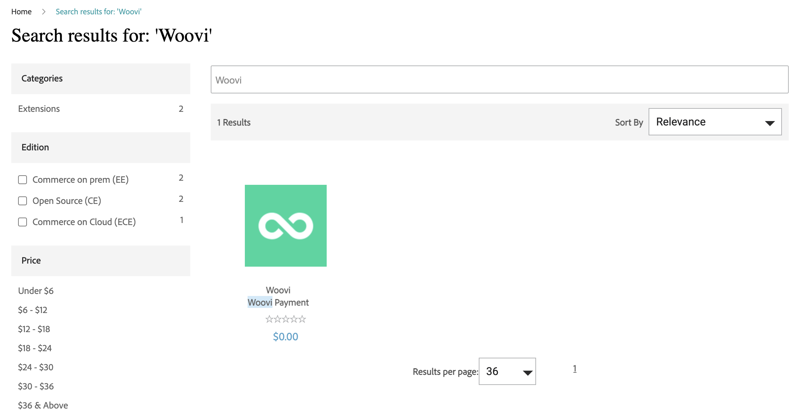
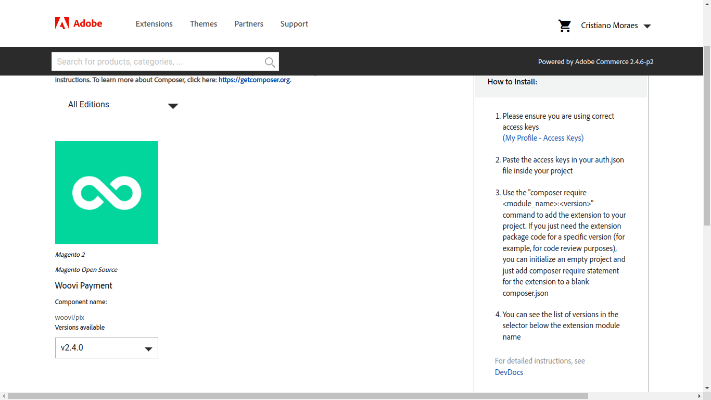

[Woovi Pix For Magento2](https://commercemarketplace.adobe.com/woovi-pix.html)




[Download Woovi Pix Magento2 Plugin - versão 2.4.0](pathname:///magento2/woovi_pix.2.4.0.zip) - Versão Atual

#### Instalação com Composer

É possível instalar o nosso plugin utilizando o [Composer](https://getcomposer.org).

Realize os seguintes passos:
1. Acessar Magento Marketplace
2. Buscar pelo Plugin Woovi
3. Realizar a compra grátis do mesmo
4. Clicar em instalar
5. Em "Meus Downloads" siga as instruções a direita



6. Não se esqueça de atualizar o arquivo `auth.json` seguindo as instruções do Magento acima. Exemplo de arquivo `auth.json`:

```json
{
    "http-basic": {
        "repo.magento.com": {
            "username": "CHAVE PÚBLICA",
            "password": "CHAVE PRIVADA"
        }
    }
}
```

- A chave pública/privada pode ser obtida na página de access keys do Magento.

7. Um exemplo de comando para instalar o nosso plugin é `composer require woovi/pix:2.4.0`. Acesse também a [documentação do Magento2](https://experienceleague.adobe.com/docs/commerce-operations/installation-guide/tutorials/extensions.html) para mais detalhes.