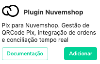
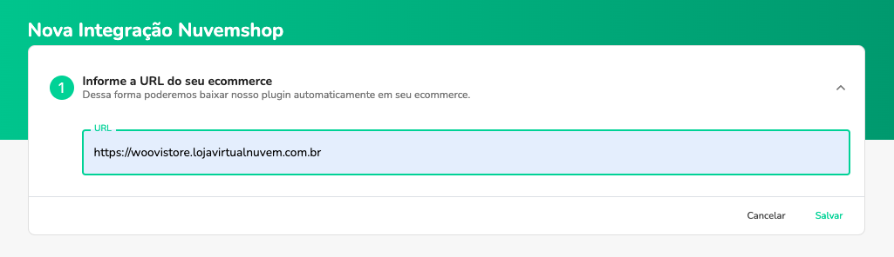
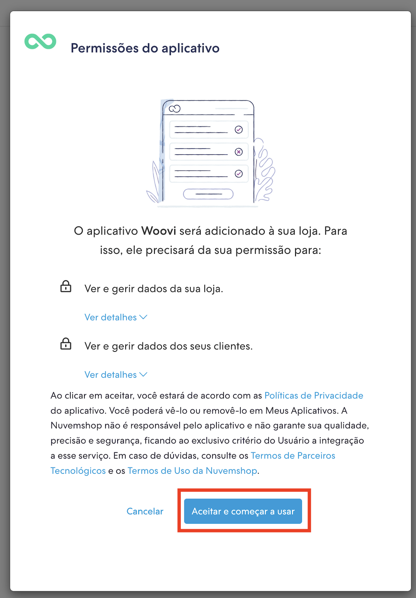
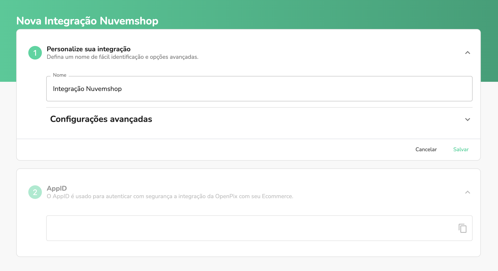
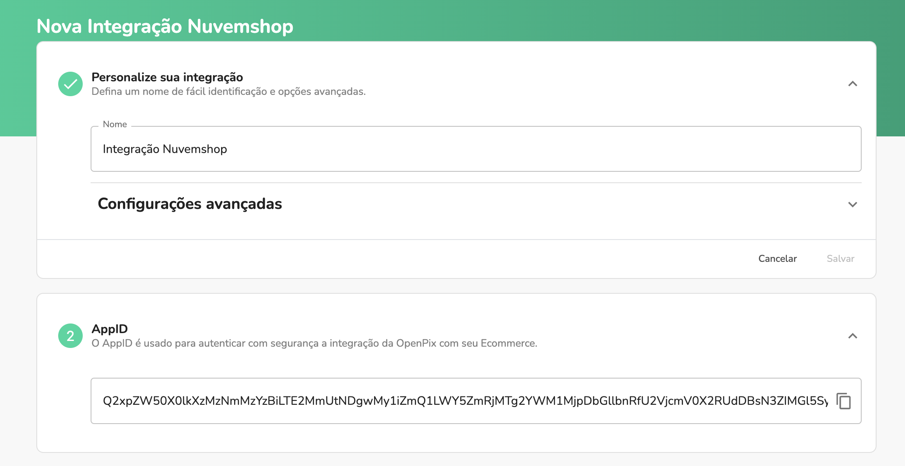

:::caution Atenção
Este documento espera que você já tenha um ecommerce na Nuvemshop, e uma conta criada na woovi
:::

## Plugin Pix para Nuvemshop

### 1. Acesse a configuração da Nuvemshop

Entre na plataforma da woovi e [clique aqui](https://app.woovi.com/home/applications/nuvemshop/add) ou vá em `API/Plugins` > `Plugin Nuvemshop` > `Adicionar`

### 2. Informe a URL do seu ecommerce

- OBS: Após informar a URL do seu ecommerce, você será redirecionado para a página de autorização da Nuvemshop.

### 3. Autorize o Aplicativo dentro da Nuvemshop

- OBS: Após você autorizar o nosso plugin no seu ecommerce, você será redirecionado novamente para plataforma para efetuar o
cadastro da aplicação Nuvemshop dentro da woovi.

### 4. Crie uma nova aplicação

