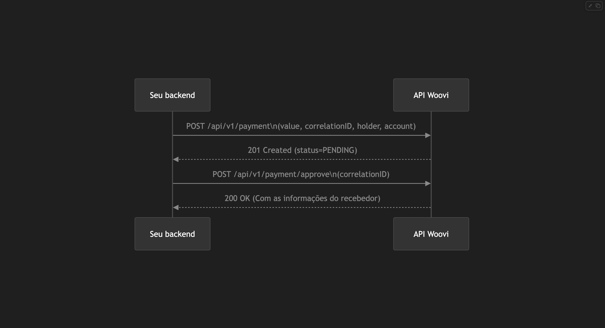
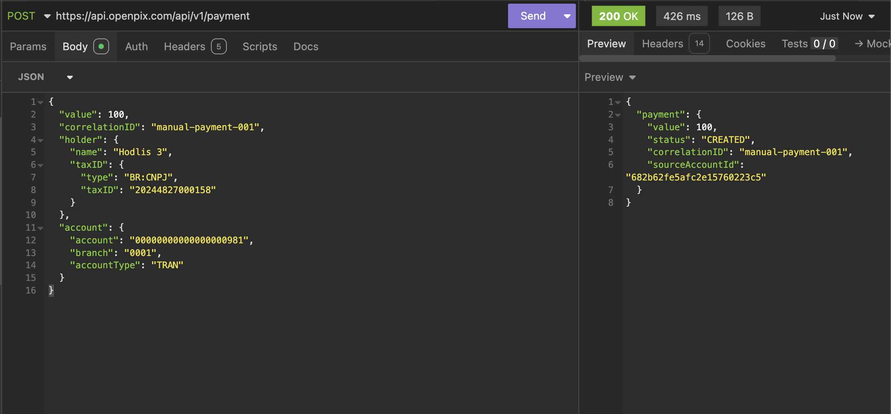
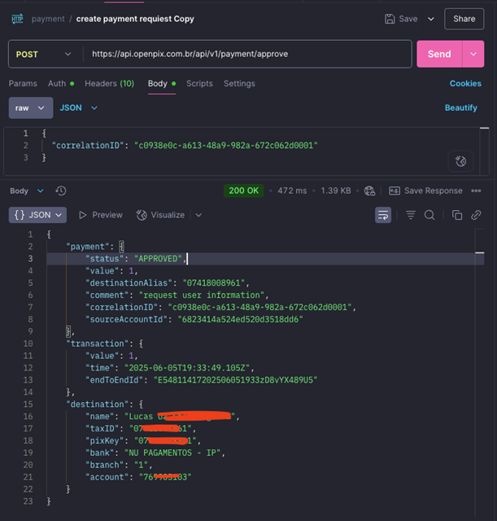

Este documento irá ajudá-lo a validar os dados bancários de um beneficiário (agência e conta) sem precisar de uma chave Pix.

A validação é feita iniciando um pagamento de 1 centavo para a conta informada. Quando o pagamento é aprovado, é gerado um payload com os dados do titular daquela conta, confirmando a quem ela pertence.

> **Pré-requisitos:** ter uma [API MASTER](../apis/api-master.md) e o **PIX OUT habilitado** na conta. Caso não tenha o Pix Out, solicite seguindo o artigo [Como ativar o Pix Out (pagamento externo)](https://ajuda.woovi.com/hc/duvidas-frequentes/articles/como-ativar-o-pix-out-pagamento-externo).

## Sequência da integração



## 1. Crie o pagamento

Crie o pagamento informando os dados bancários do beneficiário, seguindo os parâmetros do endpoint [Create Payment request](<https://developers.woovi.com/api#tag/payment-(request-access)/paths/~1api~1v1~1payment/post>).

### Campos do pagamento manual

#### holder (dados do beneficiário)

Representa a pessoa ou empresa que vai receber o pagamento.

| Campo       | Descrição                             |
| ----------- | ------------------------------------- |
| name        | Nome completo do beneficiário         |
| taxID.type  | Tipo do documento (BR:CNPJ ou BR:CPF) |
| taxID.taxID | Número do documento                   |

#### account (dados bancários)

Representa os dados da conta bancária do beneficiário.

| Campo       | Descrição                                             |
| ----------- | ----------------------------------------------------- |
| branch      | Número da agência bancária, **exatamente 4 dígitos** (ex: "0001") |
| account     | Número da conta bancária (ex: "00000000000000000981") |
| accountType | Tipo da conta (ex: "TRAN" para conta corrente)        |

#### Tipos de conta (accountType)

| Código | Descrição                                |
| ------ | ---------------------------------------- |
| CACC   | Current Account (Conta Corrente)         |
| SLRY   | Salary Account (Conta Salário)           |
| SVGS   | Savings Account (Conta Poupança)         |
| TRAN   | Transacting Account (Conta Transacional) |

#### psp (provedor de serviço de pagamento)

Representa a instituição financeira que processará o pagamento.

| Campo | Descrição                                       |
| ----- | ----------------------------------------------- |
| id    | Identificador único do PSP (código ISPB)        |
| name  | Nome da instituição financeira (ex: "WOOVI IP") |

Para descobrir o `id` do PSP, consulte o endpoint [PSPs](<https://developers.woovi.com/api#tag/psp/paths/~1api~1v1~1psp/get>) e use o ISPB no campo `psp.id`.

```bash
curl --location 'https://api.woovi.com/api/v1/payment' \
  --header 'Authorization: {APP_ID}' \
  --header 'Content-Type: application/json' \
  --data '{
    "value": 1,
    "correlationID": "c0938e0c-a613-48a9-982a-672c062d0001",
    "holder": {
      "name": "teste",
      "taxID": {
        "type": "BR:CNPJ",
        "taxID": "202********158"
      }
    },
    "psp": {
      "id": "54811417",
      "name": "WOOVI IP LTDA"
    },
    "account": {
      "account": "000********0981",
      "branch": "00**",
      "accountType": "TRAN"
    }
  }'
```



## 2. Aprove o pagamento e obtenha os dados

Após o pagamento ser aprovado, os dados bancários do titular da conta ficam disponíveis. Há **duas formas** de aprovar o pagamento:

### Opção 1: Aprovação automática (`autoApprove`) — chamada única

Enviando `autoApprove: true` no corpo da requisição do `/api/v1/payment` (a mesma da etapa anterior), o pagamento é criado **e aprovado na mesma chamada**, dispensando o `/api/v1/payment/approve`. A resposta imediata traz o `payment` com status `APPROVED` (sem o `destination` — veja [O que é retornado](#o-que-é-retornado-)).

> **Atenção:** o uso do `autoApprove` requer permissão especial na sua conta. Entre em contato com o suporte para ativar. Veja mais em [Como criar e aprovar um pagamento em uma única chamada?](../payment/payment-how-to-auto-approve.md).

```bash
curl --location 'https://api.woovi.com/api/v1/payment' \
  --header 'Authorization: {APP_ID}' \
  --header 'Content-Type: application/json' \
  --data '{
    "value": 1,
    "correlationID": "c0938e0c-a613-48a9-982a-672c062d0001",
    "autoApprove": true,
    "holder": {
      "name": "teste",
      "taxID": {
        "type": "BR:CNPJ",
        "taxID": "202********158"
      }
    },
    "psp": {
      "id": "54811417",
      "name": "WOOVI IP LTDA"
    },
    "account": {
      "account": "000********0981",
      "branch": "00**",
      "accountType": "TRAN"
    }
  }'
```

### Opção 2: Aprovação em dois passos (`/payment/approve`)

Sem o `autoApprove`, o pagamento é criado com status `CREATED` e você precisa aprová-lo em uma segunda chamada, seguindo o endpoint [Approve a Payment Request](<https://developers.woovi.com/api#tag/payment-(request-access)/paths/~1api~1v1~1payment~1approve/post>).

```bash
curl --location 'https://api.woovi.com/api/v1/payment/approve' \
  --header 'Authorization: {APP_ID}' \
  --header 'Content-Type: application/json' \
  --data '{
    "correlationID": "c0938e0c-a613-48a9-982a-672c062d0001"
  }'
```



### O que é retornado ?

Os dados do titular da conta vêm no campo `destination`. Como o Pix é enviado de forma assíncrona, esse campo **não** está na resposta imediata do `autoApprove` nem nos webhooks — o webhook [`OPENPIX:MOVEMENT_CONFIRMED`](#3-webhooks) avisa apenas que o pagamento foi confirmado, sem trazer os dados do titular.

Para obter o `destination`, consulte o endpoint [`GET /api/v1/transaction`](<https://developers.woovi.com/api#tag/transactions/paths/~1api~1v1~1transaction/get>) após a confirmação do pagamento, filtrando pela transação correspondente (por exemplo, pelo `endToEndId` recebido no webhook).

```json
{
  "payment": { },
  "transaction": { },
  "destination": {
    "name": "Luc— – —--ar",
    "taxID": "07*******61",
    "bank": "NU PAGAMENTOS - IP",
    "branch": "0001",
    "account": "76******03"
  }
}
```

- `name` — nome do titular da conta.
- `taxID` — documento do titular (CPF parcialmente mascarado / CNPJ).
- `bank` — instituição financeira da conta.
- `branch` e `account` — agência e conta confirmadas.

> No fluxo por agência e conta, o `destination` **não** retorna o campo `pixKey` (esse campo só existe na validação [por chave Pix](./validate-bank-data.md)).

## 3. Webhooks

Após a criação e confirmação do pagamento, você receberá webhooks com o status da transação. Aqui estão exemplos dos possíveis webhooks:

### Webhook de falha (`MOVEMENT_FAILED`)

```json
{
  "event": "OPENPIX:MOVEMENT_FAILED",
  "payment": {
    "value": 1,
    "status": "FAILED",
    "correlationID": "manual-payment-0009"
  },
  "transaction": {
    "value": 1,
    "endToEndId": "E54811417202507081527dYr4Cp2gfAp",
    "time": "2025-07-08T15:27:19.687Z",
    "providerRejectedReason": "AC03 - Pagamento rejeitado pelo PSP do recebedor"
  }
}
```

### Webhook de confirmação (`MOVEMENT_CONFIRMED`)

```json
{
  "event": "OPENPIX:MOVEMENT_CONFIRMED",
  "payment": {
    "status": "APPROVED",
    "value": 1,
    "correlationID": "manual-payment-0009",
    "sourceAccountId": "6823414a524ed520d3518dd6"
  },
  "transaction": {
    "value": 1,
    "time": "2025-07-08T15:27:19.687Z",
    "endToEndId": "E54811417202507081527dYr4Cp2gfAp"
  }
}
```

> Este webhook **não** traz os dados do titular da conta (`destination`). Para obtê-los, consulte o endpoint [`GET /api/v1/transaction`](<https://developers.woovi.com/api#tag/transactions/paths/~1api~1v1~1transaction/get>) — veja [O que é retornado](#o-que-é-retornado-).

Se não souber como configurar o webhook, acesse: [Criando um webhook para interceptar um Pix e chamar uma API](https://developers.woovi.com/docs/webhook/platform/webhook-platform-api).

## Prompt para IA

Copie o trecho abaixo numa IA de coding (Claude / Cursor / Gemini / ChatGPT) pra implementar a integração no seu app:

> Implemente uma função `validateBankData({ holder, account, psp })` que valida os dados bancários de um beneficiário (agência e conta) via Woovi, iniciando um pagamento de 1 centavo e devolvendo os dados do titular confirmados pelo Banco Central.
>
> **Endpoint**: `POST https://api.woovi.com/api/v1/payment`
> **Header**: `Authorization: <APP_ID_MASTER>` e `Content-Type: application/json`
> **Pré-requisito**: a conta precisa ter PIX OUT habilitado.
>
> **Body** (envie `autoApprove: true` para criar e aprovar numa única chamada, sem precisar do `/payment/approve`):
> ```json
> {
>   "value": 1,
>   "correlationID": "<uuid único>",
>   "autoApprove": true,
>   "holder": {
>     "name": "<nome do beneficiário>",
>     "taxID": { "type": "BR:CNPJ" | "BR:CPF", "taxID": "<documento>" }
>   },
>   "psp": { "id": "<ISPB de 8 dígitos>", "name": "<nome do banco>" },
>   "account": {
>     "branch": "<agência>",
>     "account": "<conta>",
>     "accountType": "CACC" | "SLRY" | "SVGS" | "TRAN"
>   }
> }
> ```
>
> **Resposta de sucesso (200)**: confirma que o pagamento foi criado/aprovado, mas **não** traz os dados do titular (`destination`) — nem os webhooks trazem. Para obtê-los, consulte `GET /api/v1/transaction` após a confirmação, filtrando pela transação correspondente.
>
> **Detalhes importantes**:
> - `autoApprove: true` exige permissão especial na conta; sem ela, crie o pagamento e aprove depois com `POST /api/v1/payment/approve` enviando o `correlationID`.
> - O `psp.id` é o código ISPB (8 dígitos) do banco — consulte `GET /api/v1/psp` para descobrir.
> - Trate os webhooks `OPENPIX:MOVEMENT_CONFIRMED` (aprovado) e `OPENPIX:MOVEMENT_FAILED` (rejeitado) para o status final da validação — os dados do titular (`destination`) vêm de `GET /api/v1/transaction`, não do webhook.
