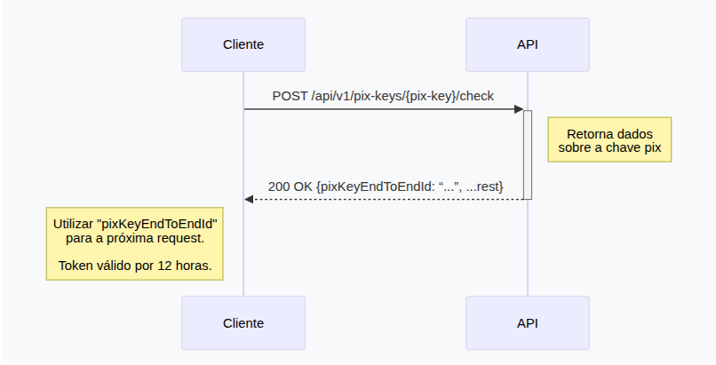

Este documento irá ajudá-lo a validar chave pix.

Uma chave pix é como se fosse um dominio DNS que aponta para uma conta no banco central, você paga para esta conta, e não diretamente para a chave

Logo é nescessario ter acesso ao numero da conta no banco central para realizar uma transação

Esse endpoint tem a função de validar esse vinculo com o banco central


- O novo endpoint  de verificação de chave de pix retornará os dados sobre uma chave de pix:
```json
curl -X POST "https://api.woovi.com/api/v1/pix-keys/{pix-key}/check" \
  -H "Authorization: {APP_ID}" \
  -H "Content-Type: application/json"
```

## Limitação de Taxa

- O endpoint tem um limitador de taxa, devido às restrições do Bacen, por isso o Woovi tem um limite de taxa nesse endpoint.
- O único problema é que quando você recebe um 404 em uma chave de pixel, após alguns 404, você receberá um 429 e precisará aguardar o reabastecimento do limitador de taxa.

### O que é retornado ?

```json
{
    "pixKeyEndToEndId": "...",
    "pixKey": "...",
    "type": "...",
    "owne": {
        "name": "...",
        "taxID": "...",
                }
}
```
