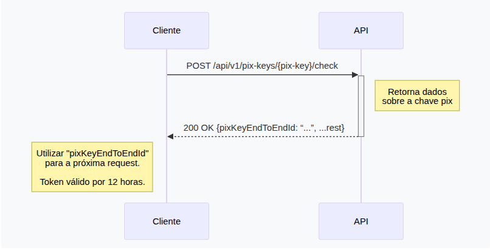

Este documento irá ajudá-lo a validar chave pix.

Uma chave pix é como se fosse um dominio DNS que aponta para uma conta no banco central, você paga para esta conta, e não diretamente para a chave

Logo é nescessario ter acesso ao numero da conta no banco central para realizar uma transação

Esse endpoint tem a função de validar esse vinculo com o banco central



O endpoint de verificação de chave de pix retornará os dados sobre uma chave de pix. A chave pode ser informada no path (GET) ou no corpo da requisição (POST).

- Usando GET com a chave no path:
```bash
curl -X GET "https://api.woovi.com/api/v1/pix-keys/{pix-key}/check" \
  -H "Authorization: {APP_ID}"
```

- Usando POST com a chave no corpo (útil quando a chave contém caracteres que ficam ruins no path, como e-mails):
```bash
curl -X POST "https://api.woovi.com/api/v1/pix-keys/check" \
  -H "Authorization: {APP_ID}" \
  -H "Content-Type: application/json" \
  --data-raw '{
    "pixKey": "<chave pix>"
  }'
```

## Limitação de Taxa

- O endpoint tem um limitador de taxa, devido às restrições do Bacen, por isso o Woovi tem um limite de taxa nesse endpoint.
- Quando você recebe um 404 em uma chave de pix, após alguns 404, você receberá um 429 e precisará aguardar o reabastecimento do limitador de taxa.

### O que é retornado ?

- O campo `type` segue o enum: `CPF`, `CNPJ`, `EMAIL`, `PHONE`, `RANDOM` ou `EVP`.
- `pixKey` volta na **forma normalizada**, independente de como você enviou:
  - CPF / CNPJ → só dígitos (`00000000191`, `00000000000191`)
  - EMAIL → em lowercase
  - PHONE → formato internacional E.164 (`+5511999998888`)
  - RANDOM / EVP → UUID de 36 chars intacto
- `owner.name` volta inteiro (não mascarado).
- `owner.taxID`: para **CPF** vem parcialmente mascarado, preservando os 3 primeiros e os 2 últimos dígitos (ex: `111.***.***-80`); para **CNPJ** vem inteiro e formatado (ex: `00.000.000/0001-91`).
- `owner.branch` e `owner.account` voltam totalmente mascarados (`****` / `********`).
- `owner.psp` é o **código ISPB** (8 dígitos) do PSP da chave, não o nome do banco — se precisar exibir o nome, mantenha um mapeamento ISPB → instituição do seu lado.
- A cada chamada o DICT é consultado de novo e um novo `pixKeyEndToEndId` é gerado. Esse identificador é o que você precisa guardar e enviar no endpoint de [Criar Pagamento](./payment-how-to-use-api-to-create.mdx).

```json
{
  "pixKeyEndToEndId": "E12345678202601011200abcdefghijk",
  "pixKey": "00000000191",
  "type": "CPF",
  "owner": {
    "name": "Fulano de Tal",
    "taxID": "000.***.***-91",
    "psp": "12345678",
    "branch": "****",
    "account": "********************"
  }
}
```

## Erros possíveis

- `400` — chave em formato inválido (não passou em `CPF` / `CNPJ` / `EMAIL` / `PHONE` / UUID de 36 chars)
- `404 PIX_KEY_INFO_NOT_FOUND` — chave válida mas não cadastrada no DICT
- `400` para chave de risco — `Pix key related to an account suspected of fraud`
- `400` para DICT indisponível — `Error verifying pix key`
- `429` — rate limit do Bacen estourado (veja a seção "Limitação de Taxa" acima)
- `403 PIX_KEY_CHECK_NOT_ALLOWED` — sua conta não tem a feature liberada

Na rota `GET` os erros voltam com `error` + `errorCode`. Na rota `POST` apenas `error` é retornado.

## Cobrança

Cada consulta bem-sucedida pode gerar uma tarifa, que vem das configurações de fee da sua conta. A cobrança é **idempotente por dia, conta e chave**: consultar a mesma chave Pix mais de uma vez na mesma conta no mesmo dia gera só uma cobrança. Erros (chave não encontrada, rate limit, etc.) não geram cobrança.

## Prompt para IA

Copie o trecho abaixo numa IA de coding (Claude / Cursor / Gemini / ChatGPT) pra implementar a integração no seu app:

> Implemente uma função `checkPixKey(pixKey)` que consulta uma chave Pix no DICT do Banco Central via Woovi e devolve nome do titular, banco e identificador necessário pra pagamento.
>
> **Endpoint**: `POST https://api.woovi.com/api/v1/pix-keys/check`
> **Header**: `Authorization: <APP_ID>` e `Content-Type: application/json`
> **Body**: `{ "pixKey": "<chave>" }` (aceita CPF, CNPJ, email, telefone ou EVP/UUID; não aceita BRcode/copia e cola — use o endpoint de decode/emv pra isso)
>
> **Resposta de sucesso (200)**:
> ```json
> {
>   "pixKeyEndToEndId": "E12345678202601011200abcdefghijk",
>   "pixKey": "<chave normalizada>",
>   "type": "CPF" | "CNPJ" | "EMAIL" | "PHONE" | "RANDOM" | "EVP",
>   "owner": {
>     "name": "<nome do titular>",
>     "taxID": "<CPF parcialmente mascarado ou CNPJ inteiro>",
>     "psp": "<ISPB de 8 dígitos do banco da chave>",
>     "branch": "****",
>     "account": "********************"
>   }
> }
> ```
>
> **Erros a tratar**: 404 `PIX_KEY_INFO_NOT_FOUND` (chave não encontrada), 400 (chave inválida ou chave de risco), 429 (rate limit do Bacen), 403 `PIX_KEY_CHECK_NOT_ALLOWED` (feature não liberada).
>
> **Detalhes importantes**:
> - `psp` é só o código ISPB (8 dígitos) — pra mostrar nome do banco mantenha um mapeamento ISPB → nome do seu lado.
> - `pixKey` sempre volta normalizado: telefone em E.164 (`+55...`), email em lowercase, CPF/CNPJ só dígitos.
> - `owner.taxID` de CPF vem mascarado (ex `111.***.***-80`); de CNPJ vem inteiro.
> - Cada consulta bem-sucedida pode ter custo, mas é idempotente por dia/conta/chave.
> - Guarde o `pixKeyEndToEndId` retornado se for usar pra criar um pagamento depois.
