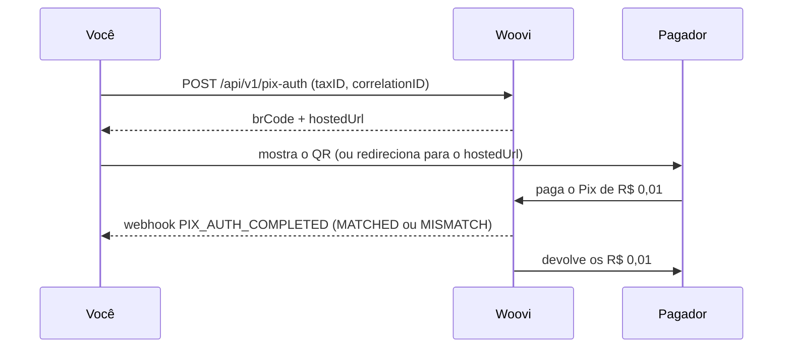

O **Pix Auth** confirma que quem está do outro lado é dono do CPF ou CNPJ informado. A pessoa paga um Pix de **R$ 0,01** a partir de uma conta bancária que está no nome desse documento. O banco pagador informa o documento do pagador, a Woovi compara com o documento que você declarou e **devolve os R$ 0,01** em qualquer resultado.

Use para confirmar a identidade de um usuário novo no cadastro, sem conta, subconta ou fluxo de KYC por trás.



## Antes de começar

| Requisito | Detalhe |
| --- | --- |
| Feature `PIX_AUTH_API` | Habilitada na sua empresa pela Woovi. Sem ela, as rotas respondem `403 You need feature PIX_AUTH_API to access this endpoint`. |
| AppID do tipo `API` ou `MASTER` | Outros tipos de aplicação recebem `403 API not allowed`. |
| Escopos `PIX_AUTH_POST` e `PIX_AUTH_GET` | Obrigatórios quando a sua aplicação usa escopos. Sem o escopo, a rota responde `403 Application does not have required scope: PIX_AUTH_POST`. |
| Saldo para a taxa | Cada Pix Auth novo cobra a taxa `PIX_AUTH_FEE` (**R$ 1,00**) da conta padrão da empresa (ou, na falta dela, da conta aberta mais antiga). |

As chamadas usam o mesmo cabeçalho `Authorization: <AppID>` de toda a API da Woovi. Se a aplicação tem IPs permitidos, eles também valem aqui.

## 1. Criar o Pix Auth

```bash
curl --request POST \
  --url https://api.woovi.com/api/v1/pix-auth \
  --header 'Authorization: <SEU_APPID>' \
  --header 'Content-Type: application/json' \
  --data-raw '{
    "correlationID": "signup-8f2c1",
    "taxID": "529.982.247-25",
    "name": "Maria Silva",
    "expiresIn": 900,
    "returnUrl": "https://example.com/signup/done"
  }'
```

| Campo | Obrigatório | Descrição |
| --- | --- | --- |
| `correlationID` | sim | Seu identificador único desta validação (até 128 caracteres). |
| `taxID` | sim | CPF ou CNPJ a validar, com ou sem pontuação. Um documento inválido responde `400 taxID must be a valid CPF or CNPJ`, e nada é cobrado. |
| `name` | não | Nome exibido ao pagador como devedor do Pix (até 100 caracteres). Padrão: `Pix Auth`. |
| `expiresIn` | não | Segundos que o Pix fica pagável, de `60` a `3600`. Padrão: `3600`. |
| `returnUrl` | não | URL `https` de volta para o seu fluxo, guardada junto com o Pix Auth e entregue à página hospedada. |

Resposta `201`:

```json
{
  "pixAuth": {
    "id": "6abd253902a0cbc48013f01e",
    "correlationID": "signup-8f2c1",
    "status": "ACTIVE",
    "result": "UNVERIFIED",
    "taxID": { "taxID": "52998224725", "type": "BR:CPF" },
    "amount": 1,
    "dueDate": "2026-09-30T16:05:28.049Z",
    "createdAt": "2026-09-30T15:50:28.049Z"
  },
  "brCode": "00020101021226870014br.gov.bcb.pix2565qr.woovi.com/qr/v2/cob/...",
  "hostedUrl": "https://pix-auth.woovi.com/B-hDJDdVZkjTyw3NBUkNK-d2iFBRL25f"
}
```

`amount` vem em centavos. `brCode` e `hostedUrl` só aparecem enquanto o Pix Auth está `ACTIVE` e com a taxa paga.

## 2. Mostrar o Pix ao pagador

Escolha uma das duas formas:

- **Na sua tela:** gere o QR Code a partir do `brCode` (ou ofereça o copia e cola).
- **Página pronta da Woovi:** redirecione o pagador para o `hostedUrl`, ou abra-o num `iframe`. A página mostra o documento mascarado, o QR, o copia e cola, o tempo restante e o resultado ao vivo. Acrescente `?lang=en` ou `?lang=pt-BR` para fixar o idioma; sem o parâmetro, vale o idioma do navegador.

A página hospedada não pede login. O link carrega só um token opaco, sem o id nem o `correlationID`, e nunca mostra o documento completo.

Dentro de um `iframe`, ao terminar, a página avisa a janela pai:

```js
window.addEventListener('message', (event) => {
  if (event.data?.type === 'woovi:pix-auth') {
    // event.data.state: 'VERIFIED' | 'MISMATCH' | 'EXPIRED' | 'NOT_FOUND'
  }
});
```

:::warning
O `postMessage` é só uma dica de interface e pode ser forjado. A decisão de aprovar o cadastro deve sempre vir do `GET` ou do webhook.
:::

## 3. Ler o resultado

```bash
curl --request GET \
  --url https://api.woovi.com/api/v1/pix-auth/signup-8f2c1 \
  --header 'Authorization: <SEU_APPID>'
```

O `:id` aceita o `id` do Pix Auth ou o seu `correlationID`. Só os Pix Auth da sua empresa são encontrados; qualquer outro responde `404 Pix authentication not found`.

```json
{
  "pixAuth": {
    "id": "6abd253902a0cbc48013f01e",
    "correlationID": "signup-8f2c1",
    "status": "COMPLETED",
    "result": "MATCHED",
    "taxID": { "taxID": "52998224725", "type": "BR:CPF" },
    "amount": 1,
    "dueDate": "2026-09-30T16:05:28.049Z",
    "completedAt": "2026-09-30T15:52:10.120Z",
    "createdAt": "2026-09-30T15:50:28.049Z"
  }
}
```

Em vez de fazer _polling_, você pode receber o resultado por [webhook](./pix-auth-webhooks.mdx).

## Status e resultado

Decida pelo campo `result`:

| `status` | `result` | Significado |
| --- | --- | --- |
| `ACTIVE` | `UNVERIFIED` | Aguardando o Pix. |
| `COMPLETED` | `MATCHED` | O pagador é dono do documento declarado. |
| `COMPLETED` | `MISMATCH` | Outra pessoa pagou, ou o arranjo Pix rejeitou o pagamento. Quem pagou nunca é informado. |
| `EXPIRED` | `UNVERIFIED` | Ninguém pagou dentro do `expiresIn`. |
| `FAILED` | `UNVERIFIED` | O Pix Auth não pôde ser concluído. Crie outro com um `correlationID` novo. |

Um Pix Auth não pago passa a `EXPIRED` assim que o `dueDate` vence, mesmo antes de o processo interno de expiração rodar.

## Idempotência pelo `correlationID`

Um `correlationID` identifica **uma** validação, para sempre.

- Repetir o `POST` com o mesmo `correlationID` e o mesmo `taxID` enquanto o Pix Auth está `ACTIVE` responde **`200`** com o mesmo Pix Auth, o mesmo `brCode` e o mesmo `hostedUrl`, **sem cobrar de novo**. Dois `POST` simultâneos com o mesmo `correlationID` também resultam em um único Pix Auth.
- Reutilizar o `correlationID` para outro documento, ou depois que a validação terminou (`COMPLETED`, `EXPIRED` ou `FAILED`), responde **`409`**:

```json
{
  "error": "correlationID already used by another Pix authentication",
  "code": "CORRELATION_ID_ALREADY_USED"
}
```

Para validar o mesmo documento de novo, use um `correlationID` novo.

## Taxa e saldo insuficiente

Cada Pix Auth novo cobra **R$ 1,00** (`PIX_AUTH_FEE`) uma única vez, mesmo que o `POST` seja repetido. Sem saldo para a taxa, a resposta é **`422`** e o `brCode` não é entregue:

```json
{
  "error": "Insufficient balance to pay the Pix authentication fee",
  "code": "INSUFFICIENT_BALANCE"
}
```

Recarregue a conta e repita o `POST` **com o mesmo `correlationID`**: a cobrança é refeita sobre o mesmo Pix Auth, sem duplicar.

## Erros

| HTTP | `code` | Quando |
| --- | --- | --- |
| `400` | — | Corpo inválido, `returnUrl` sem `https` ou `taxID` que não é CPF nem CNPJ válido. |
| `401` | — | AppID inválido ou IP fora da lista permitida. |
| `403` | — | Sem a feature `PIX_AUTH_API`, sem o escopo exigido ou tipo de aplicação não permitido. |
| `404` | — | (`GET`) Nenhum Pix Auth com esse id ou `correlationID` na sua empresa. |
| `409` | `CORRELATION_ID_ALREADY_USED` | `correlationID` já usado para outro documento ou para uma validação encerrada. |
| `422` | `INSUFFICIENT_BALANCE` | Sem saldo para a taxa `PIX_AUTH_FEE`. |
| `429` | `RATE_LIMITED` | Tentativas demais para o mesmo documento ou IP. Aguarde e tente de novo. |
| `502` | `UPSTREAM_ERROR` | O Pix não pôde ser criado. Tente de novo. |

A referência completa das rotas está na [API Reference](/api#tag/pixAuth/POST/api/v1/pix-auth).
