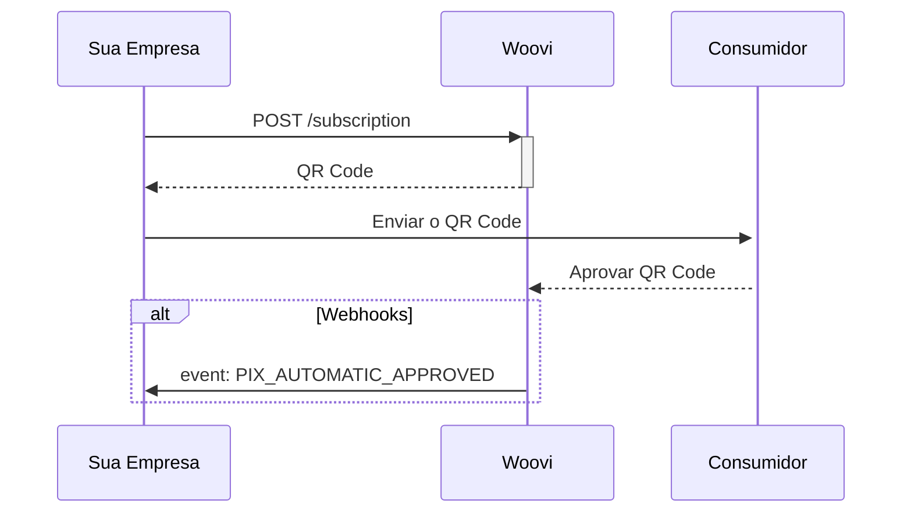
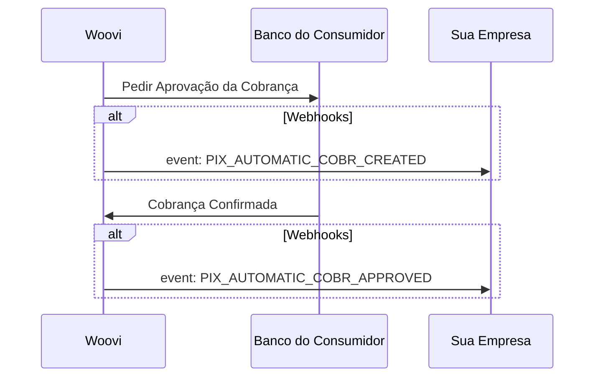
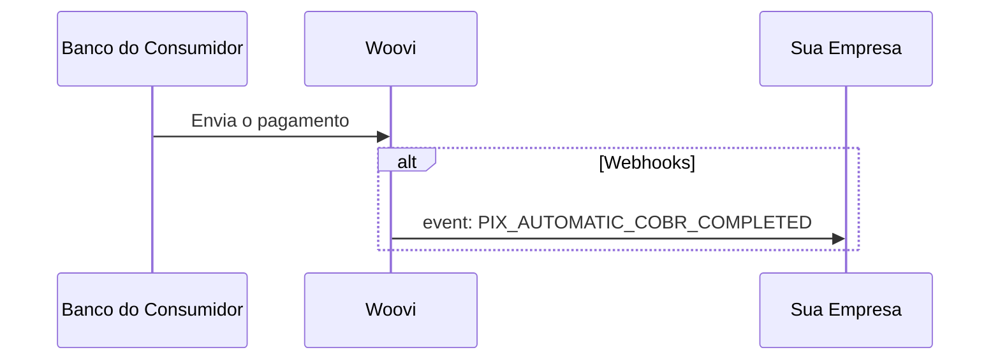
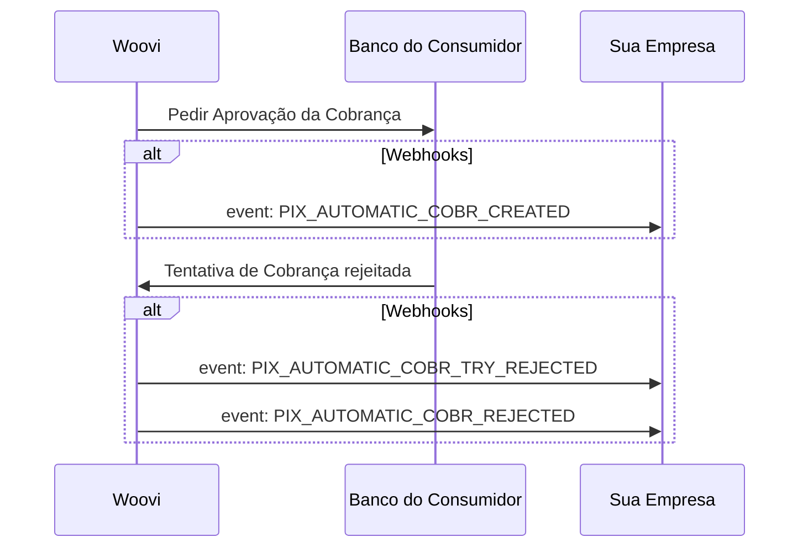
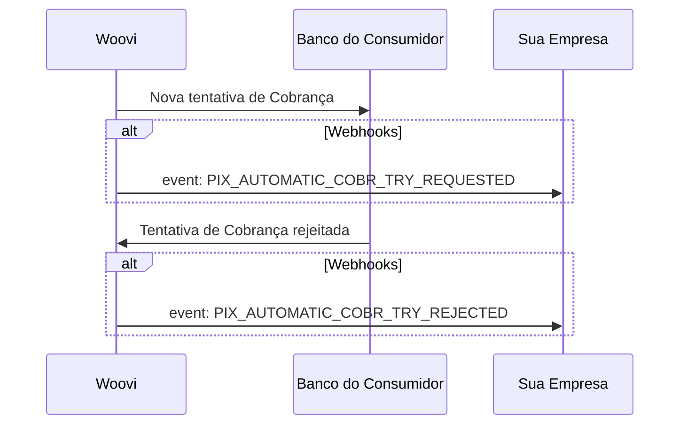
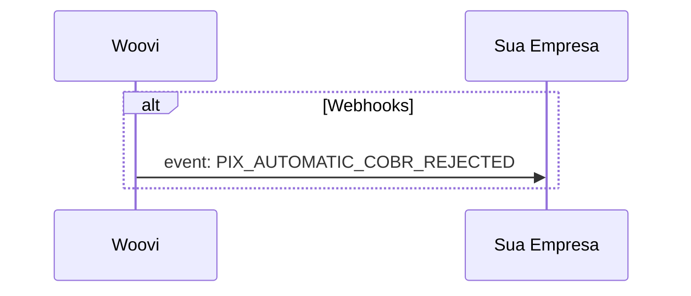
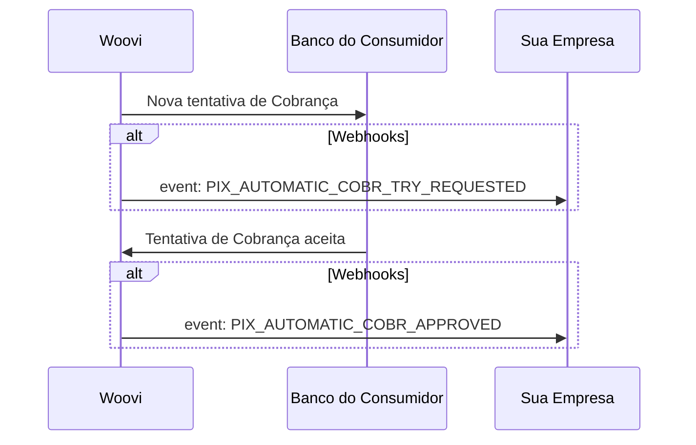

## Criação de uma assinatura

## Criação da Cobrança Recorrente
A criação da Cobrança ocorre 4 dias antes da data de pagamento da cobrança. Isso é importante para garantir que está tudo certo com a cobrança, e que tanto a Woovi, quanto o banco de destino estejam aptos a realizar a cobrança.

## Recebimento de um pagamento

Esse fluxo ocorre no dia do pagamento definido, após ter a cobrança confirmada.

## Cobrança recorrente rejeitada

Esse fluxo ocorre quando uma cobrança é rejeitada pelo banco do consumidor sem retentativas.

O evento `PIX_AUTOMATIC_COBR_TRY_REJECTED` é recebido imediatamente após o banco informar da falha da cobrança

O evento `PIX_AUTOMATIC_COBR_REJECTED` é recebido após a expiração da cobrança e a última tentativa de cobrança falhou

### Novas Retentativas
Caso tenha habilitado retentativas no cadastro da assinatura, após a primeira tentativa de cobrança rejeitada, serão feitas até 3 novas tentativas de cobranças.

A primeira será feita um dia após a data da cobrança.
A segunda na data intermediária entre a data da cobrança e a data de expiração.
A terceira na data de expiração da cobrança.

Cada tentativa de cobrança seguirá o fluxo abaixo em caso seja rejeitada.

Se nenhuma tentativa for aceita até a data de expiração, será enviado o webhook `PIX_AUTOMATIC_COBR_REJECTED`

Caso a tentativa seja aceita, o seguinte fluxo ocorrerá

