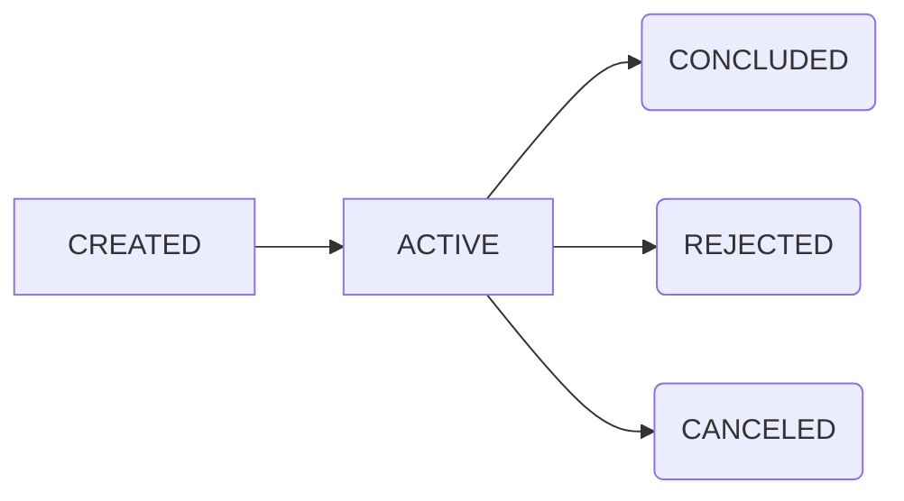

### Assinatura (Subscription)

A assinatura é a entidade mais abrangente, no caso do pix automático, o seu tipo é `PIX_RECURRING`. A assinatura poderá ter os seguintes status:

- `ACTIVE`: Assinatura ativa e criando novas parcelas nas datas pré definidas.
- `COMPLETED`: Assinatura concluída e não criará novas parcelas. (Especificadamente quando a assinatura tem uma data final).
- `EXPIRED`: Possui uma parcela que foi expirada
- `INACTIVE`: Assinartura cancelada

### Pix Automático (PixRecurring)

Quando a assinatura é do tipo `PIX_RECURRING`, ela terá um novo status dentro do objeto `pixRecurring`. Isso é necessário porque o status do Pix Automático é alterado de mandeira independente da assinatura.

O status sempre se inicia com `CREATED`, após o consumidor aprovar o QR Code no aplcativo do banco ele muda de status para `APPROVED`, nesse cenário, ele já comecará a criar as cobranças.

Caso o consumidor deseja cancelar a assinatura, ele pode cancelar a qualquer momento no aplicativo do banco. Nesse caso ele mudará de status para `REJECTED`.

Caso você deseja cancelar a assinatura, o status irá ser alterado para `CANCELED`.

- `CREATED`: Status padrão de quando é criado 
- `APPROVED`: Aprovado pelo consumidor e poderá ser criado as cobranças
- `CANCELED`: Cancelado pelo usuário
- `REJECTED`: Autorização removida pelo consumidor

### Parcela (Installment)

- `SCHEDULED`: Status padrão de quando é criada. Esse status significa que ela está agendada, e sua cobrança ocorerá na data prevista.
- `ACTIVE`: Ela é movida para esse status após estar agendada. Nesse status a COBR já foi criada e aprovado pelo banco do consumidor.
- `COMPLETED`: Quando o usuário pagou a cobrança que está relacionada
- `EXPIRED`: Quando a cobrança passou do prazo de vencimento e não teve pagamento
- `CANCELED`: Quando a parcela foi cancelada, pode ocorrer manualmente ou devido a um erro ao gerar a cobrança

As primeiras parcelas são geradas junto com a assinatura, com a data prevista definida pelo `dayGenerateCharge` com o status `SCHEDULED`. Em caso de assinatura mensal, elas são geradas sempre no mesmo dia, se ela for criada no dia 31 e o próximo mês não tiver essa data, ela será ajustada para o último dia do mês.

### Cobrança Recorrente (COBR) 

As cobranças que serão criadas para debitar automaticamente do cliente.

Por padrão ele é criado 4 dias antes da data de cobrança. Após ser criado, é feita uma requisição para o banco do consumidor para ele ser aprovado ou rejeitado. Após o COBR ser criado, em poucos instantes deverá receber a confirmação se foi aceito ou rejeitado.

- `CREATED`: Status padrão de quando é criada
- `ACTIVE`: Cobrança aceita pelo banco do consumidor
- `CONCLUDED`: Cobrança realizada com sucesso
- `REJECTED`: Cobrança rejeitada pelo banco do consumidor
- `CANCELED`: Cobrança cancelada 

