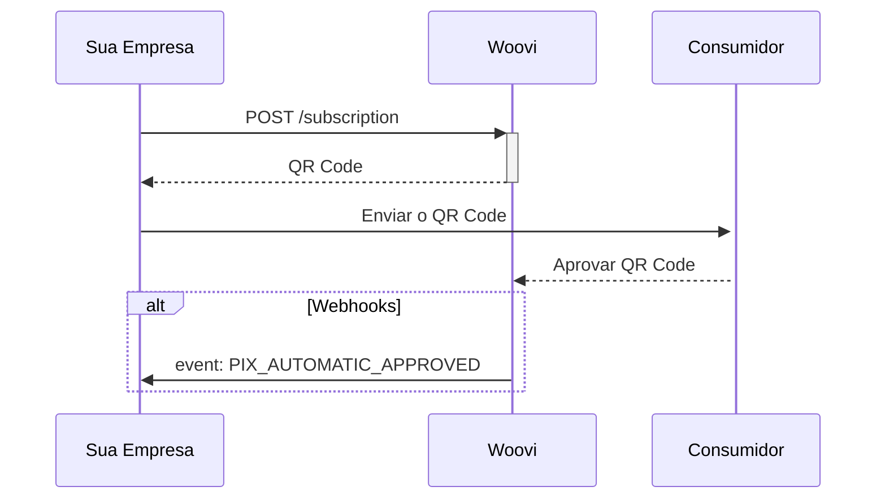
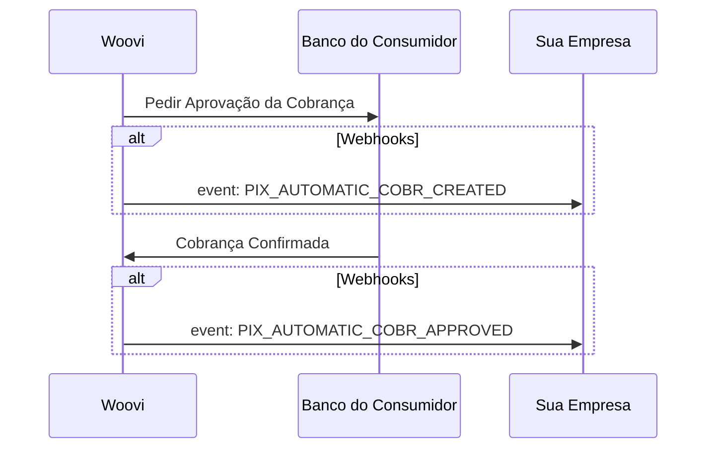
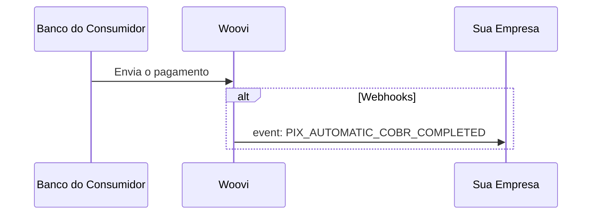

## Configurar os webhooks

A primeira etapa é configurar os [webhooks](./pix-automatic-webhooks.md) para ser notificado quando houver alguma alteração de status. Caso ainda não saiba como cadastrar os webhooks na nossa plataforma, veja o nosso [tutorial](../webhook/platform/webhook-platform-api.mdx)

Os indispensáveis são:

1. PIX_AUTOMATIC_APPROVED : Recorrência aprovada
2. PIX_AUTOMATIC_COBR_COMPLETED : Pagamento realizado com sucesso

A próxima etapa é realizar uma requisição POST para a [criação da assinatura](./pix-automatic-how-to-create.md)

## Criação de uma assinatura

## Criação da Cobrança Recorrente
A criação da Cobrança ocorre 4 dias antes da data de pagamento da cobrança. Isso é importante para garantir que está tudo certo com a cobrança, e que tanto a Woovi, quanto o banco de destino estejam aptos a realizar a cobrança.

## Recebimento de um pagamento

Esse fluxo ocorre no dia do pagamento definido, após ter a cobrança confirmada.

