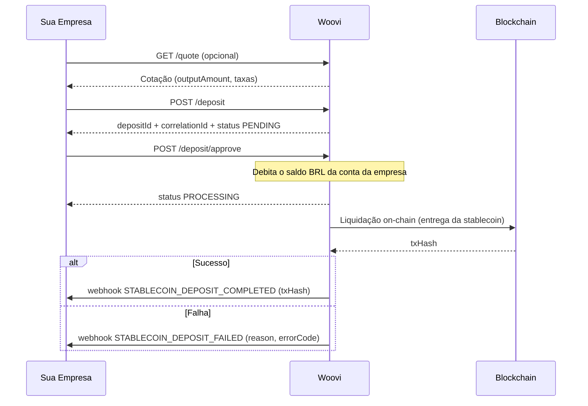
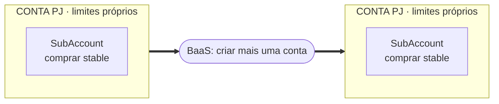
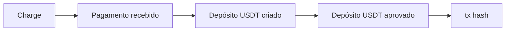
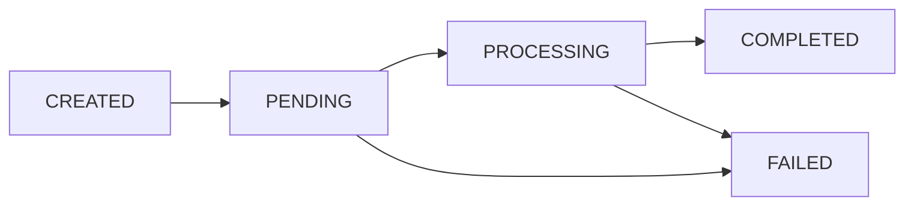

O fluxo de stablecoin segue a ideia de **criar um depósito e aprová-lo**: a aprovação debita o saldo em BRL da conta da sua empresa e entrega a stablecoin (USDT) na carteira de destino.

## Fluxograma



### Contas, subcontas e limites

Cada empresa (**CONTA PJ**) tem uma **subconta de stablecoin** para comprar a stable, e **cada conta tem seus próprios limites**. Precisa de outra conta? Você pode criar uma nova CONTA PJ usando o nosso [**BaaS**](/docs/category/baas).



### Recebendo via cobrança (exemplo)

Usando o fluxo normal de cobrança (charge) para receber o dinheiro do cliente e, em seguida, criar e aprovar o depósito de stablecoin:



## Pré-requisitos

1. Sua empresa precisa de uma subconta de stablecoin com status `CONFIRMED` (KYB aprovado). Veja [O que é o Stablecoin?](./stablecoin-what-is-it.md).
2. A conta da empresa precisa de **saldo em BRL** suficiente — a aprovação debita esse saldo para comprar a stablecoin.
3. Configure os [webhooks](./stablecoin-webhooks.md) para ser notificado quando o depósito concluir ou falhar. Os indispensáveis são:
   - `STABLECOIN_DEPOSIT_COMPLETED`
   - `STABLECOIN_DEPOSIT_FAILED`

## Passo a passo

### 1. (Opcional) Cotar o valor

Antes de criar o depósito, você pode consultar quanto de stablecoin o cliente receberá:

GET `/api/v1/stablecoin/quote?value=10000&currency=USDT`

A resposta traz `outputAmount`, `basePrice` e as taxas aplicadas (`appliedFees`). Útil para exibir a cotação na sua interface. A cotação fica em cache por 60 segundos.

### 2. Criar o depósito

POST `/api/v1/stablecoin/deposit`

```json
{
  "value": 10000,
  "currency": "USDT",
  "network": "POLYGON",
  "correlationId": "my-unique-id"
}
```

O depósito é criado com status `PENDING` e retorna `depositId`, `correlationId` e a `quote`. Guarde o `correlationId` — ele identifica o depósito nas próximas etapas.

### 3. Aprovar o depósito (comprar a stablecoin)

POST `/api/v1/stablecoin/deposit/approve`

```json
{ "correlationId": "my-unique-id" }
```

A aprovação **debita o saldo em BRL da conta da sua empresa** (a `companyBankAccount` da subconta), converte para stablecoin e envia para a carteira de destino. O status passa para `PROCESSING`. Não há cobrança Pix para um cliente pagar — o débito acontece na própria conta no momento da aprovação.

### 4. Acompanhar a conclusão

Quando a stablecoin é entregue na blockchain, você recebe o webhook `STABLECOIN_DEPOSIT_COMPLETED` (com o `txHash` da transação on-chain). Em caso de falha, recebe `STABLECOIN_DEPOSIT_FAILED`.

Você também pode consultar o status a qualquer momento:

GET `/api/v1/stablecoin/deposit/find?correlationId=my-unique-id`

## Estados do depósito

O depósito percorre os seguintes status:

| Status | Significado |
| --- | --- |
| `CREATED` | Depósito recém-criado |
| `PENDING` | Criado; aguardando a aprovação |
| `PROCESSING` | Aprovado; liquidação on-chain em andamento |
| `COMPLETED` | Stablecoin entregue na blockchain (com `txHash`) |
| `FAILED` | Falhou em alguma etapa |


