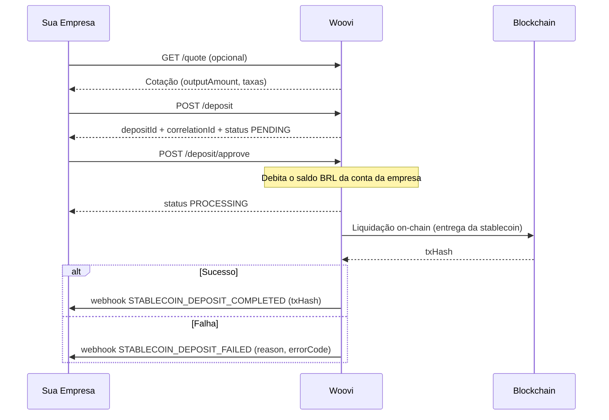
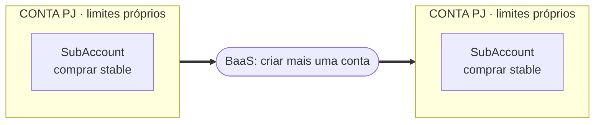
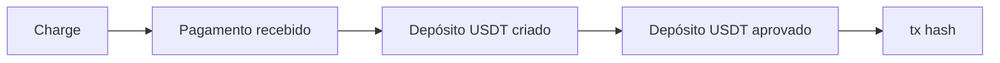
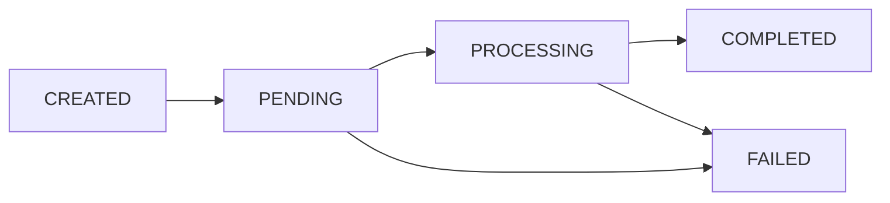

O fluxo em BRL segue a ideia de **criar um depósito e aprová-lo**: a aprovação debita o saldo em BRL da conta da sua empresa e entrega a stablecoin (USDT) na carteira de destino.

Para entrada em USD via WIRE ou ACH, siga o [fluxo em USD](#entrada-em-usd-wire-ou-ach). Ele retorna instruções bancárias e não usa a aprovação do depósito.

## Fluxograma (BRL)


```mermaid
sequenceDiagram
    participant E as Sua Empresa
    participant W as Woovi
    participant B as Blockchain
    E->>W: GET /quote (opcional)
    W-->>E: Cotação (outputAmount, taxas)
    E->>W: POST /deposit
    W-->>E: depositId + correlationId + status PENDING
    E->>W: POST /deposit/approve
    Note over W: Debita o saldo BRL da conta da empresa
    W-->>E: status PROCESSING
    W->>B: Liquidação on-chain (entrega da stablecoin)
    B-->>W: txHash
    alt Sucesso
        W->>E: webhook STABLECOIN_DEPOSIT_COMPLETED (txHash)
    else Falha
        W->>E: webhook STABLECOIN_DEPOSIT_FAILED (reason, errorCode)
    end
```

### Contas, subcontas e limites

Cada empresa (**CONTA PJ**) tem uma **subconta de stablecoin** para comprar a stable, e **cada conta tem seus próprios limites**. Precisa de outra conta? Você pode criar uma nova CONTA PJ usando o nosso [**BaaS**](/docs/category/baas).


```mermaid
flowchart LR
  subgraph PJ1["CONTA PJ · limites próprios"]
    SA1["SubAccount<br/>comprar stable"]
  end
  BAAS(["BaaS: criar mais uma conta"])
  subgraph PJ2["CONTA PJ · limites próprios"]
    SA2["SubAccount<br/>comprar stable"]
  end
  PJ1 ==> BAAS ==> PJ2
  click BAAS "/docs/category/baas" "Documentação de BaaS"
```

### Recebendo via cobrança (exemplo)

Usando o fluxo normal de cobrança (charge) para receber o dinheiro do cliente e, em seguida, criar e aprovar o depósito de stablecoin:


```mermaid
flowchart LR
  A["Charge"] --> B["Pagamento recebido"] --> C["Depósito USDT criado"] --> D["Depósito USDT aprovado"] --> E["tx hash"]
```

## Pré-requisitos

1. Sua empresa precisa de uma subconta de stablecoin com status `CONFIRMED` (KYB aprovado). Veja [O que é o Stablecoin?](./stablecoin-what-is-it.md).
2. A conta da empresa precisa de **saldo em BRL** suficiente — a aprovação debita esse saldo para comprar a stablecoin.
3. Configure os [webhooks](./stablecoin-webhooks.md) para ser notificado quando o depósito concluir ou falhar. Os indispensáveis são:
   - `STABLECOIN_DEPOSIT_COMPLETED`
   - `STABLECOIN_DEPOSIT_FAILED`

## Passo a passo

### 1. (Opcional) Cotar o valor

Antes de criar o depósito, você pode consultar quanto de stablecoin o cliente receberá:

GET `/api/v1/stablecoin/quote?value=10000&currency=USDT`

A resposta traz `outputAmount`, `basePrice` e as taxas aplicadas (`appliedFees`). Útil para exibir a cotação na sua interface. A cotação fica em cache por 60 segundos.

### 2. Criar o depósito

POST `/api/v1/stablecoin/deposit`

```json
{
  "value": 10000,
  "currency": "USDT",
  "network": "POLYGON",
  "correlationId": "my-unique-id"
}
```

O depósito é criado com status `PENDING` e retorna `depositId`, `correlationId` e a `quote`. Guarde o `correlationId` — ele identifica o depósito nas próximas etapas.

### 3. Aprovar o depósito (comprar a stablecoin)

POST `/api/v1/stablecoin/deposit/approve`

```json
{ "correlationId": "my-unique-id" }
```

A aprovação **debita o saldo em BRL da conta da sua empresa** (a `companyBankAccount` da subconta), converte para stablecoin e envia para a carteira de destino. O status passa para `PROCESSING`. Não há cobrança Pix para um cliente pagar — o débito acontece na própria conta no momento da aprovação.

### 4. Acompanhar a conclusão

Quando a stablecoin é entregue na blockchain, você recebe o webhook `STABLECOIN_DEPOSIT_COMPLETED` (com o `txHash` da transação on-chain). Em caso de falha, recebe `STABLECOIN_DEPOSIT_FAILED`.

## Estados do depósito

O depósito percorre os seguintes status:

| Status | Significado |
| --- | --- |
| `CREATED` | Depósito recém-criado |
| `PENDING` | Criado; aguardando a aprovação |
| `PROCESSING` | Aprovado; liquidação on-chain em andamento |
| `COMPLETED` | Stablecoin entregue na blockchain (com `txHash`) |
| `FAILED` | Falhou em alguma etapa |


```mermaid
flowchart LR
  CREATED --> PENDING --> PROCESSING --> COMPLETED
  PENDING --> FAILED
  PROCESSING --> FAILED
```

## Entrada em USD (WIRE ou ACH)

A subconta vinculada à conta bancária do AppID precisa estar `CONFIRMED` e com `usdUnlocked: true`. Consulte `GET /api/v1/stablecoin/subaccount/kyb/usd?subAccountId=...`. O upload de documentos e a aceitação de um pedido de KYB não liberam USD automaticamente; aguarde a aprovação da análise. O sandbox da Avenia não libera as operações em USD, embora o upload de documentos possa ser validado em staging.

1. Opcionalmente, cote com `GET /api/v1/stablecoin/quote?inputCurrency=USD&inputPaymentMethod=WIRE&value=10000&currency=USDC&network=BASE`. Para ACH, use `inputPaymentMethod=ACH`. Essa cotação não cria um depósito.
2. Crie o depósito em `POST /api/v1/stablecoin/deposit` com os parâmetros abaixo. `value` é um inteiro em centavos de USD (`10000` = USD 100,00); `grossAmount` não é aceito. Os valores de `quote` na resposta são em unidades da moeda e as taxas do provedor aparecem em `quote.appliedFees`, cada uma com sua moeda.

```json
{
  "inputCurrency": "USD",
  "inputPaymentMethod": "WIRE",
  "value": 10000,
  "currency": "USDC",
  "network": "BASE",
  "destinationWalletAddress": "0x1234567890123456789012345678901234567890",
  "correlationId": "usd-wire-order-1"
}
```

3. Guarde o `depositId` e o `correlationId`. Use os dados bancários e a referência `depositMessage` retornados em `usdDepositInstructions` para enviar a transferência pela modalidade solicitada. Não chame `/deposit/approve`: a entrada USD não debita a conta BRL da Woovi.
4. Acompanhe a entrega pelos webhooks `STABLECOIN_DEPOSIT_COMPLETED` e `STABLECOIN_DEPOSIT_FAILED`. `PENDING` significa que o depósito aguarda o envio/processamento da transferência; somente `COMPLETED` confirma a entrega da stablecoin.

`correlationId` e `destinationWalletAddress` são obrigatórios para USD. Repetir a mesma requisição com o mesmo `correlationId` retorna o depósito existente. Se a resposta for HTTP `202` sem instruções bancárias, guarde esse identificador e contate o suporte para conciliar o resultado original. Não crie outro depósito ou envie outra transferência para tentar resolver uma resposta incerta.

A carteira de destino pode estar nas seguintes redes, conforme o ativo:

| Ativo | Redes de destino |
| --- | --- |
| USDC | POLYGON, ETHEREUM, BASE, CELO, BNB |
| USDT | POLYGON, ETHEREUM, CELO, TRON, BNB |

Se a rede for omitida, o padrão é `POLYGON`. Uma combinação não suportada é rejeitada. Quando a subconta exige whitelist, a carteira e sua rede precisam estar previamente aprovadas. O `subAccountId`, quando informado, deve pertencer à mesma conta bancária do AppID.
