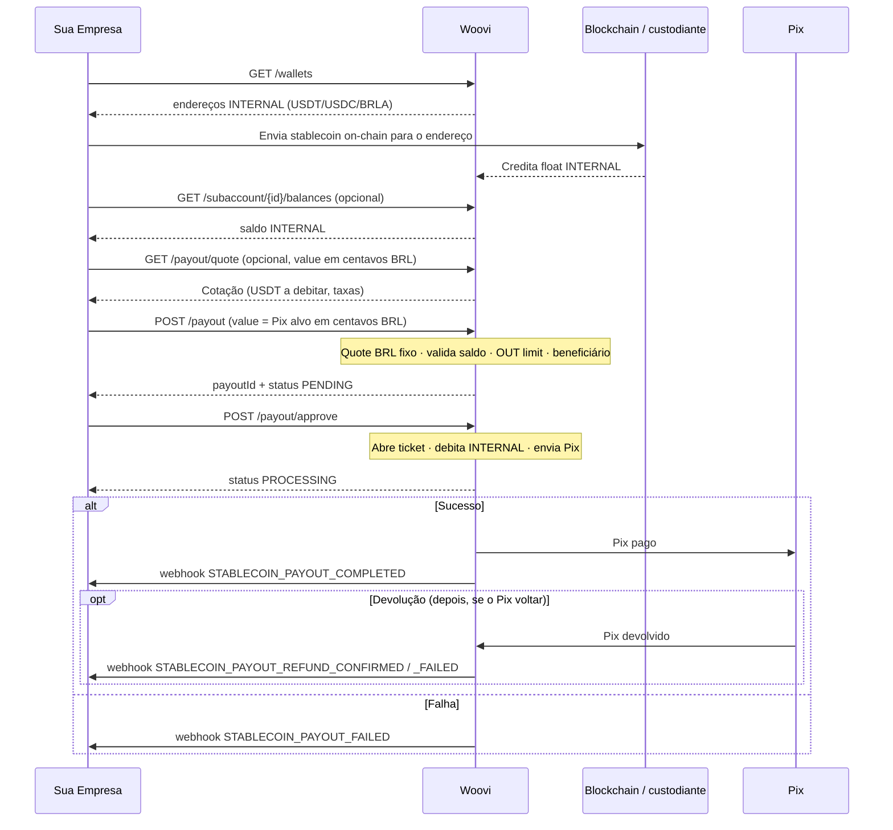
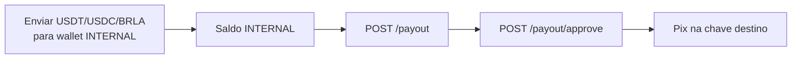
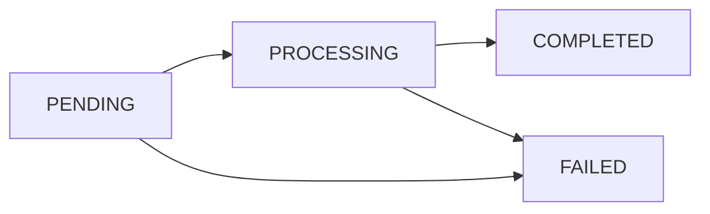

O fluxo de **payout** segue o mesmo padrão do [depósito](./stablecoin-flow.md): **criar** e depois **aprovar**. Você informa o **valor alvo em BRL**; na aprovação o float **INTERNAL** (USDT/USDC/BRLA) é debitado conforme a cotação e o Pix é enviado.

Ativos suportados na saída: `USDT`, `USDC`, `BRLA`.

## Fluxograma



### Contas, float INTERNAL e limites

Cada empresa (**CONTA PJ**) com KYB `CONFIRMED` tem uma **subconta** de stablecoin. O payout gasta apenas o saldo do float **INTERNAL** (endereços retornados por `GET /wallets`) — não o saldo da carteira smart wallet on-chain usada no depósito.

O valor do payout consome o limite Woovi **OUT** da conta. Precisa de outra conta? Use o [**BaaS**](/docs/category/baas).



## Pré-requisitos

1. Subconta de stablecoin com status `CONFIRMED` (KYB aprovado). Veja [O que é o Stablecoin?](./stablecoin-what-is-it.md).
2. App com o escopo `STABLECOIN_PAYOUT_CREATE` (criar/consultar payout). Para listar wallets e saldos, também `STABLECOIN_SUBACCOUNT_LIST`.
3. **Saldo INTERNAL** suficiente no ativo que você vai gastar — financie os endereços de `GET /api/v1/stablecoin/wallets` antes.
4. Limite **OUT** disponível na conta.
5. Configure os [webhooks](./stablecoin-webhooks.md):
   - `STABLECOIN_PAYOUT_COMPLETED`
   - `STABLECOIN_PAYOUT_FAILED`
   - `STABLECOIN_PAYOUT_REFUND_CONFIRMED`
   - `STABLECOIN_PAYOUT_REFUND_FAILED`

## Passo a passo

### 1. Obter as carteiras INTERNAL

GET `/api/v1/stablecoin/wallets`

Retorna os endereços custodiados ligados ao `companyBankAccount` do App. Envie USDT/USDC/BRLA on-chain para o endereço da rede/ativo desejado.

```bash
curl --request GET \
  --url https://api.woovi.com/api/v1/stablecoin/wallets \
  --header 'Authorization: <SEU_APP_ID>'
```

```json
{
  "status": "ok",
  "companyBankAccountId": "682b62fe5afc2e15760223c5",
  "subAccountId": "b3e144dd-7d10-457c-9b85-033085722ed1",
  "wallets": [
    { "address": "0xa5A558fedfCeFa9ac2751649Fa21CA0279F216Ce", "currency": "USDT", "network": "POLYGON" },
    { "address": "TR54aGQPQghGDmHVuTQfSShP3ce8a6pCiT", "currency": "USDT", "network": "TRON" }
  ]
}
```

Guarde o `subAccountId` para consultar saldos.

### 2. (Opcional) Conferir o saldo

GET `/api/v1/stablecoin/subaccount/{subAccountId}/balances`

Os saldos vêm na **unidade da moeda** (não em centavos). Faça poll após o envio on-chain até o crédito aparecer.

```bash
curl --request GET \
  --url https://api.woovi.com/api/v1/stablecoin/subaccount/b3e144dd-7d10-457c-9b85-033085722ed1/balances \
  --header 'Authorization: <SEU_APP_ID>'
```

```json
{
  "status": "ok",
  "subAccountId": "b3e144dd-7d10-457c-9b85-033085722ed1",
  "balances": { "USDT": 0.425458, "USDC": 0, "BRLA": 0 }
}
```

### 3. (Opcional) Cotar o payout

GET `/api/v1/stablecoin/payout/quote?value=10000&currency=USDT`

`value` é o **Pix alvo em centavos de BRL** (ex.: `10000` = R$ 100,00). A resposta traz quanto de `currency` será debitado do float INTERNAL (`inputAmount`) e as taxas aplicadas.

```bash
curl --request GET \
  --url 'https://api.woovi.com/api/v1/stablecoin/payout/quote?value=10000&currency=USDT' \
  --header 'Authorization: <SEU_APP_ID>'
```

### 4. Criar o payout

POST `/api/v1/stablecoin/payout`

```json
{
  "value": 10000,
  "currency": "USDT",
  "pixKey": "thiago@entria.com.br",
  "correlationId": "payout-001",
  "pixMessage": "pagamento stablecoin"
}
```

Na criação a Woovi: cota com BRL fixo → valida saldo INTERNAL → consome o limite **OUT** (em BRL) → resolve o beneficiário Pix → persiste como `PENDING`. O ticket **ainda não** é aberto.

O `correlationId` é opcional e serve de **idempotência**: reutilizar o mesmo valor devolve o payout já criado.

```bash
curl --request POST \
  --url https://api.woovi.com/api/v1/stablecoin/payout \
  --header 'Authorization: <SEU_APP_ID>' \
  --header 'content-type: application/json' \
  --data '{
    "value": 10000,
    "currency": "USDT",
    "pixKey": "thiago@entria.com.br",
    "correlationId": "payout-001"
  }'
```

```json
{
  "status": "PENDING",
  "payoutId": "6a721b1e3c785acfaebfa01c",
  "correlationId": "payout-001",
  "pixKey": "thiago@entria.com.br",
  "pixKeyOwner": {
    "name": "Marshall Bilderback",
    "taxId": "***.751.185-**",
    "bankName": "SICOOB"
  },
  "quote": {
    "inputAmount": 19.68,
    "inputCurrency": "USDT",
    "outputAmount": 100,
    "outputCurrency": "BRL",
    "rate": 5.12,
    "fee": 0.04
  }
}
```

### 5. Aprovar o payout (enviar o Pix)

POST `/api/v1/stablecoin/payout/approve`

```json
{ "correlationId": "payout-001" }
```

A aprovação abre o ticket no provedor (debita o float INTERNAL e envia o Pix). O status passa para `PROCESSING`.

```bash
curl --request POST \
  --url https://api.woovi.com/api/v1/stablecoin/payout/approve \
  --header 'Authorization: <SEU_APP_ID>' \
  --header 'content-type: application/json' \
  --data '{ "correlationId": "payout-001" }'
```

### 6. Acompanhar a conclusão

Quando o Pix é pago, você recebe `STABLECOIN_PAYOUT_COMPLETED` (pode incluir `endToEndId`). Em falha, `STABLECOIN_PAYOUT_FAILED`. Detalhes em [Webhooks](./stablecoin-webhooks.md).

Um payout já liquidado ainda pode ser **devolvido** depois — o `status` continua `COMPLETED` e a devolução chega em `STABLECOIN_PAYOUT_REFUND_CONFIRMED` ou `STABLECOIN_PAYOUT_REFUND_FAILED`. Veja [Webhooks do payout](#webhooks-do-payout) abaixo.

Você também pode consultar a qualquer momento:

- GET `/api/v1/stablecoin/payout/{payoutId}`
- GET `/api/v1/stablecoin/payout?correlationId=payout-001`

Enquanto o payout não estiver terminal, a consulta relê o ticket no provedor e atualiza o status (incluindo `PAID` → `COMPLETED`).

## Webhooks do payout

O payout é **assíncrono**: o `POST /payout/approve` devolve `PROCESSING` e o resultado chega por webhook. Cadastre os quatro eventos — os dois primeiros fecham o payout, os dois últimos existem porque um Pix já pago ainda pode voltar dias depois.

| Evento | O que aconteceu | O que fazer |
| --- | --- | --- |
| `STABLECOIN_PAYOUT_COMPLETED` | O Pix saiu e foi pago | Dar baixa no pedido. `endToEndId` é o comprovante |
| `STABLECOIN_PAYOUT_FAILED` | O Pix **não** saiu | O float INTERNAL não foi gasto; leia `reason` / `errorCode` e reenvie se fizer sentido |
| `STABLECOIN_PAYOUT_REFUND_CONFIRMED` | O Pix saiu, voltou, e o valor está **disponível de novo** no seu saldo de stablecoin | Seguro reembolsar o seu cliente final |
| `STABLECOIN_PAYOUT_REFUND_FAILED` | O Pix saiu, voltou, mas o valor **não** está disponível para você | **Não** credite o cliente final; abra conciliação |

`FAILED` e `REFUND_*` são mutuamente exclusivos no mesmo payout: `FAILED` é o Pix que nunca saiu; `REFUND_*` é o Pix que saiu e voltou.

### Concilie pelo correlationID

Todos os eventos trazem `stablePayout.correlationID` — o mesmo `correlationId` que você enviou no `POST /payout`. É por ele que você acha o pedido do seu lado; o `stablePayout.id` é o id interno da Woovi.

A entrega é **at least once**: um mesmo evento pode chegar mais de uma vez. Trate cada handler como idempotente — nos eventos de devolução, o campo de deduplicação é `refund.providerTicketId` (o ticket da devolução, não o do payout).

### A devolução não muda o status do payout

Quando um payout liquidado volta, o `stablePayout.status` **continua `COMPLETED`** — o Pix realmente saiu, e voltar o status atrás quebraria a máquina de estados que você construiu em cima do `STABLECOIN_PAYOUT_COMPLETED`. O que voltou vem em um bloco `refund` à parte:

```json
{
  "event": "STABLECOIN_PAYOUT_REFUND_CONFIRMED",
  "stablePayout": {
    "id": "6a721b1e3c785acfaebfa01c",
    "status": "COMPLETED",
    "inputAmount": 3379,
    "inputCurrency": "BRLA",
    "outputAmount": 33.73,
    "outputCurrency": "BRL",
    "pixKey": "thiago@entria.com.br",
    "endToEndId": "E123...",
    "correlationID": "payout-001"
  },
  "company": { "name": "Acme Corp" },
  "refund": {
    "status": "CONFIRMED",
    "amount": 3379,
    "currency": "BRLA",
    "destination": "SUBACCOUNT_BALANCE",
    "providerTicketId": "9a1c4f7e-2b83-4d55-9c0e-1f6a2d3b4c5d",
    "refundEndToEndId": "E54811417202608251402",
    "refundedAt": "2026-08-25T14:02:41.318Z"
  }
}
```

Dois campos costumam ser lidos errado:

- **`refund.amount` está em centavos de `refund.currency`** — o ativo de entrada, a mesma unidade do `stablePayout.inputAmount`. Não é o `outputAmount` em BRL.
- **`refund.destination`** diz se o dinheiro é seu de novo: só `SUBACCOUNT_BALANCE` é sacável por você. `MAIN_BALANCE` significa que o crédito caiu fora da sua subconta e precisa de intervenção manual; `NONE`, que nada foi creditado.

Payloads completos de todos os eventos, incluindo o de falha: [Webhooks de Stablecoin](./stablecoin-webhooks.md).

## Estados do payout

| Status | Significado |
| --- | --- |
| `PENDING` | Criado; aguardando aprovação |
| `PROCESSING` | Aprovado; ticket / Pix em andamento |
| `COMPLETED` | Pix pago com sucesso |
| `FAILED` | Falhou em alguma etapa |

A devolução de um payout liquidado **não** é um status: o payout segue `COMPLETED` e o retorno aparece no bloco `refund`. Veja [Webhooks do payout](#webhooks-do-payout).



## Referência rápida

| Etapa | Método | Rota | Escopo |
| --- | --- | --- | --- |
| Carteiras | GET | `/api/v1/stablecoin/wallets` | `STABLECOIN_SUBACCOUNT_LIST` |
| Saldos | GET | `/api/v1/stablecoin/subaccount/{id}/balances` | `STABLECOIN_SUBACCOUNT_LIST` |
| Cotação | GET | `/api/v1/stablecoin/payout/quote` | `STABLECOIN_PAYOUT_CREATE` |
| Criar | POST | `/api/v1/stablecoin/payout` | `STABLECOIN_PAYOUT_CREATE` |
| Aprovar | POST | `/api/v1/stablecoin/payout/approve` | `STABLECOIN_PAYOUT_CREATE` |
| Consultar | GET | `/api/v1/stablecoin/payout/{payoutId}` | `STABLECOIN_PAYOUT_CREATE` |

Detalhes dos payloads: [Endpoints](./stablecoin-endpoints.md).
