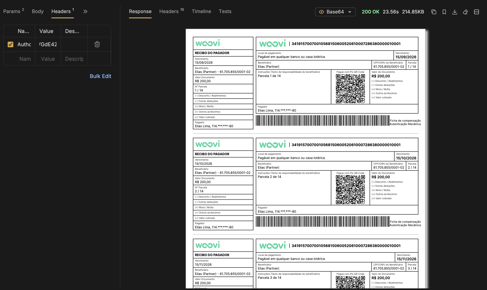

import Tabs from '@theme/Tabs';
import TabItem from '@theme/TabItem';

O carnê reúne em um único PDF as cobranças da sua assinatura — uma via por parcela,
numeradas como "Parcela N de M", no formato que o seu cliente já conhece.

Para gerar, faça uma chamada GET para o _endpoint_
`/api/v1/subscriptions/{id}/payment-book`. Você pode acessar a
[referência da API](/api) para os detalhes desse _endpoint_.

Você precisa de um AppID com o escopo `SUBSCRIPTION_PAYMENT_BOOK_GET`
([como adicionar escopos](../apis/api-scopes.md)). Ele não é um escopo de leitura:
como a chamada cria cobranças, não o conceda a uma integração que apenas consulta.

:::warning Só para assinatura recorrente

O carnê existe apenas para assinaturas do tipo `RECURRENT` — as que você cria com
`"type": "RECURRENT"`, cobradas por Pix ou por boleto a cada ciclo.

**Pix Automático não tem carnê.** Em uma assinatura `PIX_RECURRING` quem executa a
cobrança é o banco do seu cliente, na data de cada ciclo, então não há como
antecipá-las em um documento. Pedir o carnê de uma assinatura Pix Automático
responde `400`.

:::

## Antes de chamar

As parcelas futuras de uma assinatura ainda não existem como cobrança — cada uma é
criada perto do seu vencimento. Imprimir um carnê antecipa isso.

**A chamada é síncrona e cria todas as cobranças que faltam no período.** Não há fila
nem protocolo para consultar depois: ela percorre as parcelas até o mês/ano que você
pediu, cria a cobrança de cada uma que ainda não tem, e só responde quando o PDF está
pronto. **Por isso o tempo de resposta é bem maior que o de uma chamada comum, e cresce
com o número de cobranças a criar** — um carnê longo pedido pela primeira vez é o pior
caso, porque nenhuma parcela dele existe ainda.

Na prática:

- **Aumente o _timeout_ do seu cliente** antes de pedir um período longo. O padrão da
  maioria das bibliotecas HTTP é curto demais para essa chamada.
- **Peça só o período que você vai entregar ao cliente.** Ampliar depois é rápido e
  cria apenas a diferença (veja [Reimprimir e ampliar](#reimprimir-e-ampliar)).
- As cobranças criadas são reais: aparecem no seu extrato, disparam webhook quando
  pagas e valem as condições comerciais da sua conta — incluindo eventual taxa de
  emissão de boleto, se houver.
- É um GET com efeito. Não coloque essa URL atrás de _retry_ automático, _prefetch_
  de link ou monitoramento.

## Parâmetros

| parâmetro | onde | obrigatório | descrição |
| --- | --- | --- | --- |
| `id` | rota | sim | O `globalID` ou o id da assinatura. Diferente dos outros _endpoints_ de assinatura, esse não aceita `correlationID`. |
| `month` | query | **sim** | Último mês que o carnê alcança, de `1` a `12`. |
| `year` | query | **sim** | Último ano que o carnê alcança. |

`month` e `year` são inclusivos: a parcela do mês informado entra no carnê.

:::info Por que mês e ano são obrigatórios

Em outras plataformas o par é opcional e apenas filtra um documento pronto. Aqui ele
decide quantas cobranças serão criadas, então não existe padrão — quem chama informa
até onde quer ir.

:::

## O teto: 31 de dezembro do ano que vem

`year` aceita o ano atual ou o seguinte. Passar disso **retorna erro, não corta no
limite** — não existe chamada que peça além do teto e gere só até lá:

```json
// GET .../payment-book?month=6&year=2030
{ "error": "O carnê só pode ser gerado até o final do ano que vem" }
```

O limite é só superior. Um mês/ano no passado é aceito e rende poucas ou nenhuma via;
se não sobrar nada no período, a resposta é `400`.

## O que entra no carnê

- **Só assinatura `RECURRENT`.**
- **Com boleto, só frequência mensal ou maior** (`MONTHLY`, `BIMONTHLY`, `QUARTERLY`,
  `SEMIANNUALLY`, `ANNUALLY`). Sem boleto, qualquer frequência vale.
- **Só parcelas em aberto viram via.** Parcela já paga ou expirada fica de fora, para
  o carnê não convidar a pagar duas vezes — por isso o número de vias pode ser menor
  que o número de parcelas do período.

## Exemplo

```sh
curl --request GET \
  --url 'https://api.woovi.com/api/v1/subscriptions/UGF5bWVudFN1YnNjcmlwdGlvbjo2M2UzYjJiNzczZDNkOTNiY2RkMzI5OTM=/payment-book?month=12&year=2027' \
  --header 'Authorization: <AUTHORIZATION>' \
  --output carne.pdf
```

Se tudo ocorreu bem o _status code_ é `200` e o corpo é **o PDF**, não um JSON:

```
Content-Type: application/pdf
Content-Disposition: inline; filename="payment-book-63e3b2b773d3d93bcdd32993.pdf"
```

O PDF traz uma via por parcela, numeradas como "Parcela N de M", cada uma com o
recibo do pagador, o código de barras e o QR Code Pix — o seu cliente paga a via
por qualquer um dos dois:



:::tip No Postman use "Send and Download"

O corpo é binário. Um `Send` normal mostra o PDF como texto embaralhado e parece erro.
Em caso de erro, aí sim o corpo é JSON.

:::

### Exemplos em código

<Tabs>
  <TabItem value="shell-curl" label="Shell + cURL" default>

```sh
curl --request GET \
  --url 'https://api.woovi.com/api/v1/subscriptions/UGF5bWVudFN1YnNjcmlwdGlvbjo2M2UzYjJiNzczZDNkOTNiY2RkMzI5OTM=/payment-book?month=12&year=2027' \
  --header 'Authorization: <AUTHORIZATION>' \
  --output carne.pdf
```

  </TabItem>
  <TabItem value="javascript" label="JavaScript + Fetch">

```js
import { writeFile } from 'node:fs/promises';

const response = await fetch(
  'https://api.woovi.com/api/v1/subscriptions/UGF5bWVudFN1YnNjcmlwdGlvbjo2M2UzYjJiNzczZDNkOTNiY2RkMzI5OTM=/payment-book?month=12&year=2027',
  {
    headers: {
      Authorization: '<AUTHORIZATION>',
    },
  },
);

// Em erro o corpo é JSON; no sucesso é o PDF.
if (!response.ok) {
  throw new Error((await response.json()).error);
}

await writeFile('carne.pdf', Buffer.from(await response.arrayBuffer()));
```

  </TabItem>
</Tabs>

## Reimprimir e ampliar

Repetir a chamada é seguro: uma parcela que já tem cobrança não ganha outra.

- **Reimprimir não cobra de novo.** O PDF pode vir com menos vias que antes se alguma
  parcela foi paga no intervalo, e isso é o esperado.
- **Ampliar cria só a diferença.** Pedir até 05/2027 e depois até 12/2027 cria apenas
  as parcelas novas do segundo pedido, e o segundo PDF já vem com o carnê inteiro até
  o novo corte.
- **Se vier menos vias do que você esperava, ou o seu cliente deu _timeout_**, chame a
  mesma URL de novo: o que já existe não é cobrado outra vez.

O carnê não avisa o seu cliente — entregar o PDF é com você. As cobranças seguem
disparando os webhooks normais quando forem pagas.

## Erros

| status | mensagem | quando |
| --- | --- | --- |
| `400` | `O carnê exige o mês e o ano até onde gerar` | faltou `month` ou `year` |
| `400` | `Mês inválido` | `month` fora de 1 a 12 |
| `400` | `O carnê só pode ser gerado até o final do ano que vem` | `year` passou do teto |
| `400` | `Carnê está disponível apenas para assinaturas recorrentes` | a assinatura não é `RECURRENT` |
| `400` | `Payment book with boleto is only available for monthly or longer subscriptions` | boleto em frequência menor que mensal |
| `400` | `Nenhuma cobrança pôde ser emitida para este carnê` | nada no período pôde ser cobrado |
| `401` | — | `Authorization` ausente ou inválido, ou IP fora da lista permitida |
| `403` | — | o token não carrega o escopo `SUBSCRIPTION_PAYMENT_BOOK_GET` |
| `404` | `Assinatura não encontrada` | nenhuma assinatura com esse id na sua conta |
| `500` | `Falha ao gerar o carnê` | não foi possível montar o documento |

Os erros de `month`/`year` são verificados antes de qualquer emissão, então não geram
cobrança.

## Conteúdos relacionados

- [Como criar uma Assinatura usando a API?](./subscription-recurrence-create-api.mdx)
- [Como criar uma Assinatura cobrada com Boleto usando a API?](./subscription-with-boleto-create-api.mdx)
- [Cobrança de boleto](../boleto/boleto-api.md)
