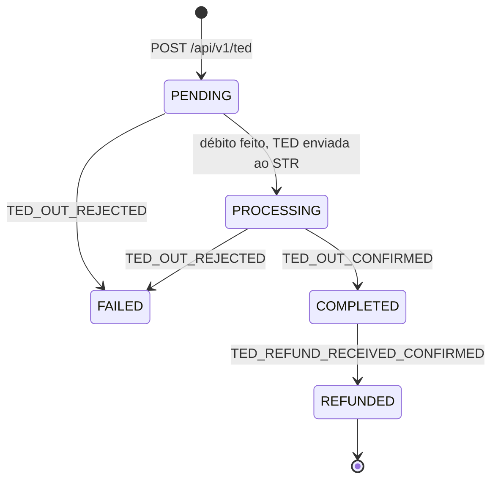
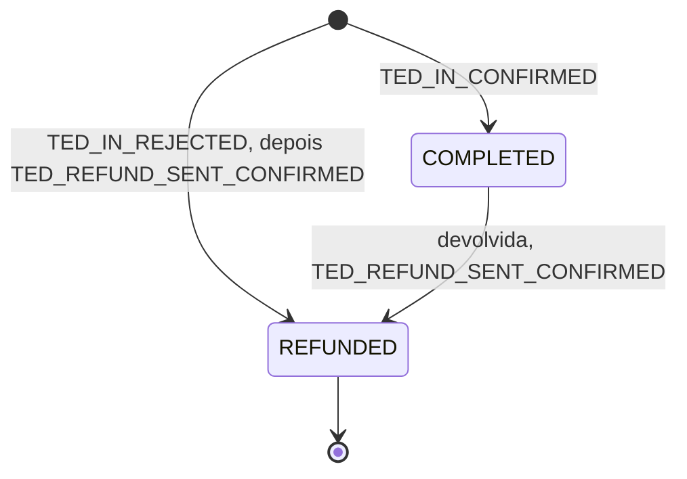

# Ciclo de vida de uma TED

Uma TED passa por alguns `status` até chegar a um resultado, e cada resultado
chega por um [webhook](./ted-webhooks.md). Esta página mostra os caminhos
possíveis, o evento de cada transição e o que fazer do seu lado.

O `status` atual está sempre em
[`GET /api/v1/ted/{correlationID}`](./ted-get-api.md#consultar-uma-ted). Os
webhooks avisam das mudanças.

## TED enviada (`direction: OUT`)

| Transição | Quando | Webhook |
| --- | --- | --- |
| → `PENDING` | O `POST /api/v1/ted` criou a TED | — |
| `PENDING` → `PROCESSING` | O valor foi debitado e a TED foi enviada ao STR. É o `status` que a resposta do `POST` costuma trazer | — |
| `PENDING` → `FAILED` | Falha antes do envio (saldo insuficiente, tarifa, lançamento). O débito não fica | `TED_OUT_REJECTED` |
| `PROCESSING` → `COMPLETED` | O BACEN liquidou a TED | `TED_OUT_CONFIRMED` |
| `PROCESSING` → `FAILED` | O BACEN rejeitou a TED, ou ela não chegou a ser entregue. O débito é estornado e o saldo volta | `TED_OUT_REJECTED` |
| `COMPLETED` → `REFUNDED` | O banco recebedor devolveu a TED e o valor voltou para a sua conta. A devolução chega como uma TED nova, `type: REFUND_RECEIVED` | `TED_REFUND_RECEIVED_CONFIRMED`, com a TED da devolução |

`COMPLETED` também não é final: uma TED liquidada ainda pode ser devolvida pelo
banco recebedor.

:::info `REFUNDED` é final
Uma TED só fica `REFUNDED` depois que o dinheiro voltou de fato, com a devolução
aceita pelo BACEN, e nunca sai desse `status`. Uma devolução que o BACEN
rejeita não muda a TED original: ela continua `COMPLETED`.
:::

## TED recebida (`direction: IN`)

Uma TED recebida já foi liquidada pelo BACEN quando chega. Ela nunca falha:
ou é creditada, ou é recusada e devolvida ao remetente.

| Transição | Quando | Webhook |
| --- | --- | --- |
| → `COMPLETED` | A TED foi creditada na sua conta | `TED_IN_CONFIRMED` |
| → `REFUNDED` | A conta de destino está encerrada ou bloqueada para receber TED. A TED é devolvida ao remetente; `errorCode` diz o motivo | `TED_IN_REJECTED` na hora, e `TED_REFUND_SENT_CONFIRMED` com a TED da devolução quando o BACEN confirma |
| `COMPLETED` → `REFUNDED` | A TED foi devolvida ao remetente depois de creditada, a seu pedido ou pelo suporte. A devolução é uma TED nova, `type: REFUND_SENT`, e a original só fica `REFUNDED` quando o BACEN aceita a devolução; se ele rejeitar, a original continua `COMPLETED` | `TED_REFUND_SENT_CONFIRMED`, com a TED da devolução, quando o BACEN confirma |

:::info Uma TED é devolvida uma vez só
Pedir a devolução de novo, ao mesmo tempo ou depois, não cria outra devolução
nem outro débito:

- com uma devolução ainda em andamento, o pedido repetido só reenvia a mesma
  devolução ao BACEN;
- com a TED já `REFUNDED`, o pedido é recusado.

Só uma devolução `FAILED` libera um novo pedido, porque o dinheiro não saiu.
:::

Uma TED para uma conta que **não existe** na Woovi também é devolvida, mas não
gera webhook: não há empresa para avisar.

## Os eventos, por status

| Evento | `direction` | `ted.status` no payload | É final? |
| --- | --- | --- | --- |
| `TED_OUT_CONFIRMED` | `OUT` | `COMPLETED` | Pode ainda ser devolvida |
| `TED_OUT_REJECTED` | `OUT` | `FAILED` | Sim |
| `TED_IN_CONFIRMED` | `IN` | `COMPLETED` | Pode ainda ser devolvida |
| `TED_IN_REJECTED` | `IN` | `REFUNDED` | Sim |
| `TED_REFUND_SENT_CONFIRMED` | `OUT` (`type: REFUND_SENT`) | `COMPLETED` | Sim |
| `TED_REFUND_RECEIVED_CONFIRMED` | `IN` (`type: REFUND_RECEIVED`) | `COMPLETED` | Sim |

Os eventos de devolução trazem a **TED da devolução**, com `correlationID`
próprio, e não a original. Hoje a TED da devolução não aponta para a original;
a original fica `REFUNDED`, e o valor e as contas das duas coincidem.

## Depois de um erro no `POST`

Um erro no `POST /api/v1/ted` pode vir **antes** ou **depois** de a TED ser
criada, e isso muda o que fazer:

| Quando | Exemplos | A TED existe? | O que fazer |
| --- | --- | --- | --- |
| Antes de criar | `INVALID_REQUEST_BODY`, `ACCOUNT_NOT_OWNED`, `ACCOUNT_BLOCKED_TED_OUT`, `OUTSIDE_STR_SESSION`, limites de TED, `TED_LIMIT_SERVICE_UNAVAILABLE` | Não | Corrija e reenvie. Pode usar o mesmo `correlationID` |
| Depois de criar | `LEDGER_FAILED` (inclusive saldo insuficiente), `FEE_FETCH_FAILED`, `SPB_FAILED` | Sim, `FAILED` | Chega um `TED_OUT_REJECTED`. Para tentar de novo, use um `correlationID` **novo**: o mesmo devolve a TED `FAILED` |

Na dúvida, consulte [`GET /api/v1/ted/{correlationID}`](./ted-get-api.md#consultar-uma-ted):
`404` quer dizer que nenhuma TED foi criada, e uma TED `FAILED` traz o motivo em
`errorCode`.

:::note Saldo insuficiente
Sem saldo, o `POST` responde `422` com `errorCode: LEDGER_FAILED`, e a TED fica
`FAILED` com `errorCode: INSUFFICIENT_BALANCE`. O motivo exato está na TED, não
na resposta do `POST`.
:::

## Montando o seu lado

1. Guarde o `correlationID` antes do `POST`. É por ele que os webhooks e a
   consulta encontram a TED.
2. Cadastre pelo menos `TED_OUT_CONFIRMED` e `TED_OUT_REJECTED` para as TEDs que
   você envia, e `TED_IN_CONFIRMED` para as que recebe. Veja
   [Como cadastrar o webhook](./ted-webhooks.md#como-cadastrar-o-webhook).
3. Aplique cada evento como "o estado atual da TED é `ted.status`", não como uma
   transição a partir do que você tinha. A entrega é _at least once_ e a ordem
   não é garantida; se estiver em dúvida, consulte a TED.
4. Se um webhook não chegar, a consulta é a fonte da verdade.
