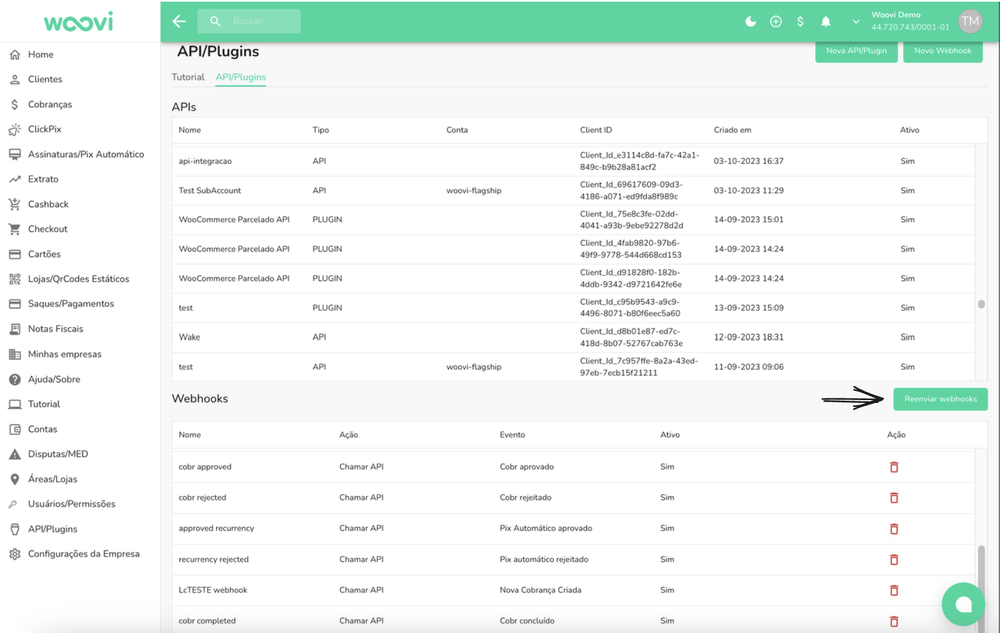
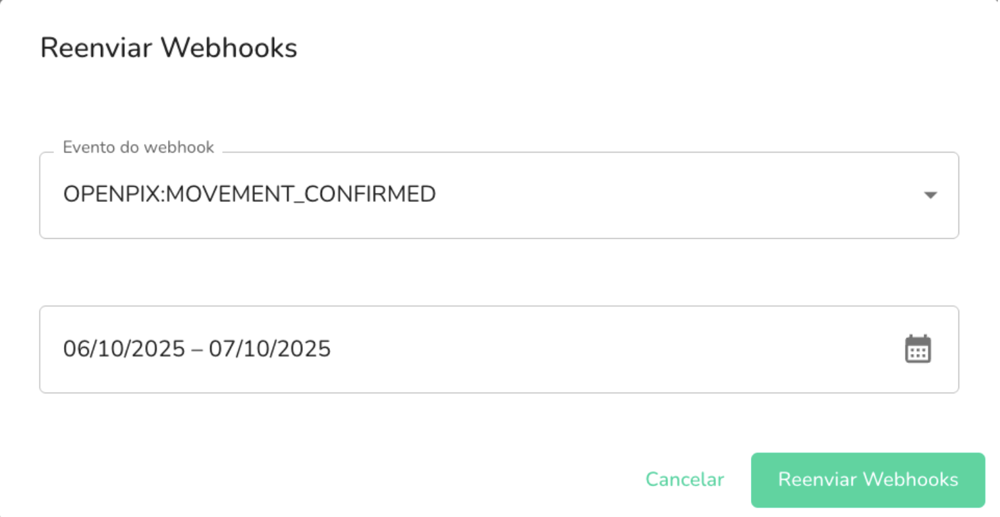
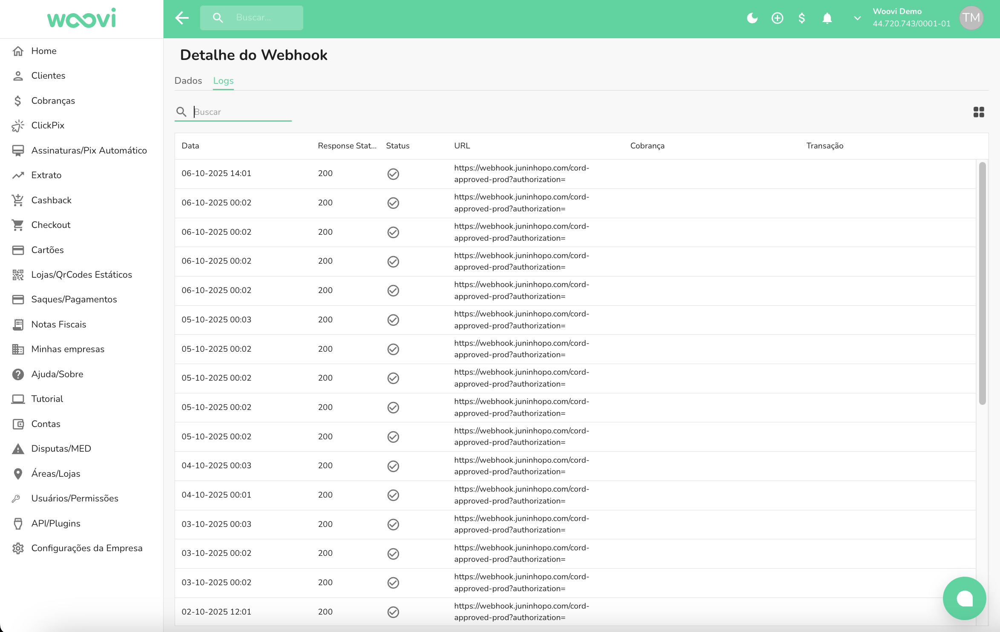

## Como reenviar um webhook na plataforma?

É possível reenviar os webhooks na plataforma

Primeiro, acesse no menu lateral esquerdo a opção API/PLUGINS.

Depois, selecione o botão de reenviar.

O webhook será reenviado para o endpoint configurado. Você pode acompanhar o status do reenvio nos logs da plataforma.

