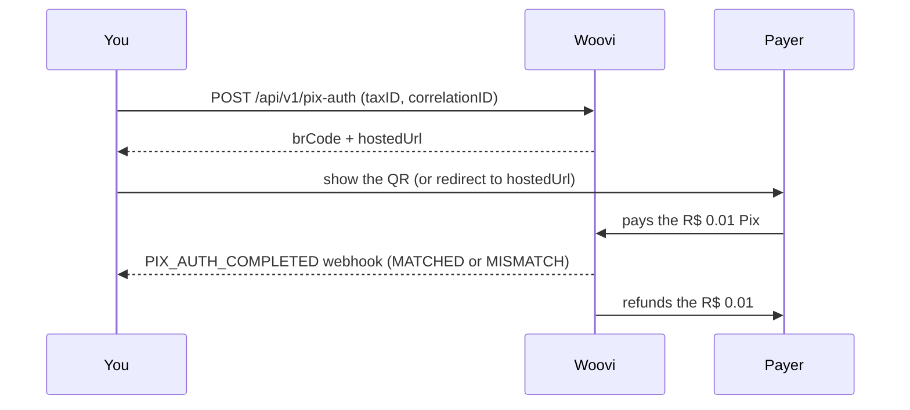

**Pix Auth** confirms that the person on the other side holds the CPF or CNPJ you declared. They pay a **R$ 0.01** Pix from a bank account under that document. The payer's bank reports the payer's document, Woovi compares it with the document you declared and **refunds the R$ 0.01** on every outcome.

Use it to confirm the identity of a new user at signup, with no account, subaccount or KYC flow behind it.



## Before you start

| Requirement | Detail |
| --- | --- |
| `PIX_AUTH_API` feature | Enabled on your company by Woovi. Without it, the routes answer `403 You need feature PIX_AUTH_API to access this endpoint`. |
| `API` or `MASTER` AppID | Other application types get `403 API not allowed`. |
| `PIX_AUTH_POST` and `PIX_AUTH_GET` scopes | Required when your application uses scopes. Without the scope, the route answers `403 Application does not have required scope: PIX_AUTH_POST`. |
| Balance for the fee | Each new Pix Auth charges the `PIX_AUTH_FEE` (**R$ 1.00**) from the company's default account (or, if there is none, from the oldest open account). |

Calls use the same `Authorization: <AppID>` header as the rest of the Woovi API. If the application has allowed IPs, they apply here too.

## 1. Create the Pix Auth

```bash
curl --request POST \
  --url https://api.woovi.com/api/v1/pix-auth \
  --header 'Authorization: <YOUR_APPID>' \
  --header 'Content-Type: application/json' \
  --data-raw '{
    "correlationID": "signup-8f2c1",
    "taxID": "529.982.247-25",
    "name": "Maria Silva",
    "expiresIn": 900,
    "returnUrl": "https://example.com/signup/done"
  }'
```

| Field | Required | Description |
| --- | --- | --- |
| `correlationID` | yes | Your unique identifier for this validation (up to 128 characters). |
| `taxID` | yes | CPF or CNPJ to validate, with or without punctuation. An invalid document answers `400 taxID must be a valid CPF or CNPJ`, and nothing is charged. |
| `name` | no | Name shown to the payer as the debtor of the Pix (up to 100 characters). Default: `Pix Auth`. |
| `expiresIn` | no | Seconds the Pix can be paid for, from `60` to `3600`. Default: `3600`. |
| `returnUrl` | no | `https` URL back to your flow, stored with the Pix Auth and handed to the hosted page. |

`201` response:

```json
{
  "pixAuth": {
    "id": "6abd253902a0cbc48013f01e",
    "correlationID": "signup-8f2c1",
    "status": "ACTIVE",
    "result": "UNVERIFIED",
    "taxID": { "taxID": "52998224725", "type": "BR:CPF" },
    "amount": 1,
    "dueDate": "2026-09-30T16:05:28.049Z",
    "createdAt": "2026-09-30T15:50:28.049Z"
  },
  "brCode": "00020101021226870014br.gov.bcb.pix2565qr.woovi.com/qr/v2/cob/...",
  "hostedUrl": "https://pix-auth.woovi.com/B-hDJDdVZkjTyw3NBUkNK-d2iFBRL25f"
}
```

`amount` is in centavos. `brCode` and `hostedUrl` are only returned while the Pix Auth is `ACTIVE` and its fee is paid.

## 2. Show the Pix to the payer

Pick one:

- **On your own screen:** render the QR Code from the `brCode` (or offer the copy-and-paste code).
- **Woovi's ready page:** redirect the payer to `hostedUrl`, or open it in an `iframe`. The page shows the masked document, the QR, the copy-and-paste code, the time left and the live result. Append `?lang=en` or `?lang=pt-BR` to force the language; without it, the browser language is used.

The hosted page needs no login. The link carries only an opaque token, never the id or the `correlationID`, and never shows the full document.

Inside an `iframe`, the page notifies the parent window when it ends:

```js
window.addEventListener('message', (event) => {
  if (event.data?.type === 'woovi:pix-auth') {
    // event.data.state: 'VERIFIED' | 'MISMATCH' | 'EXPIRED' | 'NOT_FOUND'
  }
});
```

:::warning
The `postMessage` is only a UI hint and can be forged. The decision to approve the signup must always come from the `GET` or the webhook.
:::

## 3. Read the result

```bash
curl --request GET \
  --url https://api.woovi.com/api/v1/pix-auth/signup-8f2c1 \
  --header 'Authorization: <YOUR_APPID>'
```

`:id` accepts the Pix Auth `id` or your `correlationID`. Only your company's Pix Auths are found; anything else answers `404 Pix authentication not found`.

```json
{
  "pixAuth": {
    "id": "6abd253902a0cbc48013f01e",
    "correlationID": "signup-8f2c1",
    "status": "COMPLETED",
    "result": "MATCHED",
    "taxID": { "taxID": "52998224725", "type": "BR:CPF" },
    "amount": 1,
    "dueDate": "2026-09-30T16:05:28.049Z",
    "completedAt": "2026-09-30T15:52:10.120Z",
    "createdAt": "2026-09-30T15:50:28.049Z"
  }
}
```

Instead of polling, you can receive the result by [webhook](./pix-auth-webhooks.mdx).

## Status and result

Decide on the `result` field:

| `status` | `result` | Meaning |
| --- | --- | --- |
| `ACTIVE` | `UNVERIFIED` | Waiting for the Pix. |
| `COMPLETED` | `MATCHED` | The payer holds the declared document. |
| `COMPLETED` | `MISMATCH` | Someone else paid, or the Pix arrangement rejected the payment. Who paid is never disclosed. |
| `EXPIRED` | `UNVERIFIED` | Nobody paid within `expiresIn`. |
| `FAILED` | `UNVERIFIED` | The Pix Auth could not be completed. Create another one with a new `correlationID`. |

An unpaid Pix Auth becomes `EXPIRED` as soon as its `dueDate` passes, even before the internal expiration job runs.

## Idempotency by `correlationID`

A `correlationID` names **one** validation, forever.

- Repeating the `POST` with the same `correlationID` and the same `taxID` while the Pix Auth is `ACTIVE` answers **`200`** with the same Pix Auth, the same `brCode` and the same `hostedUrl`, **without charging again**. Two concurrent `POST`s with the same `correlationID` also result in a single Pix Auth.
- Reusing the `correlationID` for another document, or after the validation ended (`COMPLETED`, `EXPIRED` or `FAILED`), answers **`409`**:

```json
{
  "error": "correlationID already used by another Pix authentication",
  "code": "CORRELATION_ID_ALREADY_USED"
}
```

To validate the same document again, use a new `correlationID`.

## Fee and insufficient balance

Each new Pix Auth charges **R$ 1.00** (`PIX_AUTH_FEE`) only once, even if the `POST` is repeated. Without balance for the fee, the response is **`422`** and no `brCode` is returned:

```json
{
  "error": "Insufficient balance to pay the Pix authentication fee",
  "code": "INSUFFICIENT_BALANCE"
}
```

Top up the account and repeat the `POST` **with the same `correlationID`**: the charge is retried on the same Pix Auth, without duplicating it.

## Errors

| HTTP | `code` | When |
| --- | --- | --- |
| `400` | — | Invalid body, `returnUrl` without `https`, or a `taxID` that is not a valid CPF or CNPJ. |
| `401` | — | Invalid AppID or IP outside the allowed list. |
| `403` | — | Missing the `PIX_AUTH_API` feature, the required scope, or an application type that is not allowed. |
| `404` | — | (`GET`) No Pix Auth with this id or `correlationID` on your company. |
| `409` | `CORRELATION_ID_ALREADY_USED` | `correlationID` already used for another document or for a finished validation. |
| `422` | `INSUFFICIENT_BALANCE` | No balance for the `PIX_AUTH_FEE`. |
| `429` | `RATE_LIMITED` | Too many attempts for the same document or IP. Wait and try again. |
| `502` | `UPSTREAM_ERROR` | The Pix could not be created. Try again. |

The full route reference is in the [API Reference](/api#tag/pixAuth/POST/api/v1/pix-auth).
