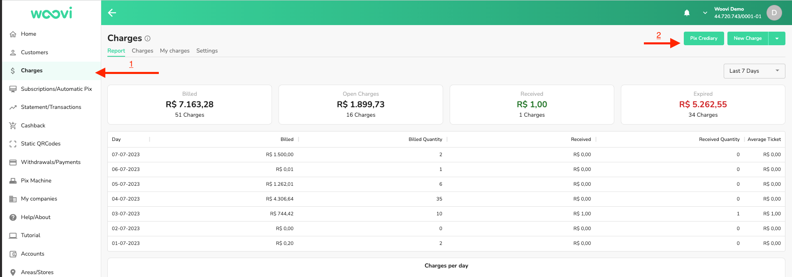
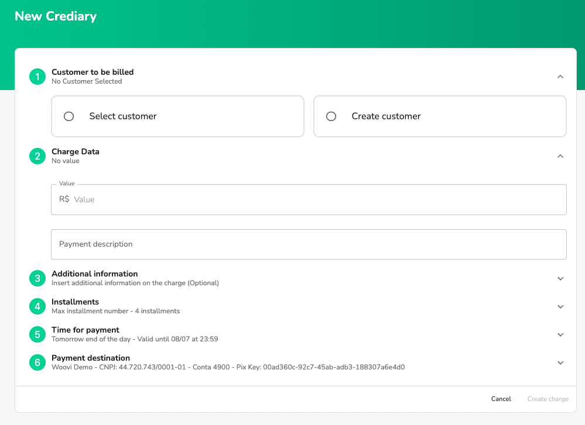
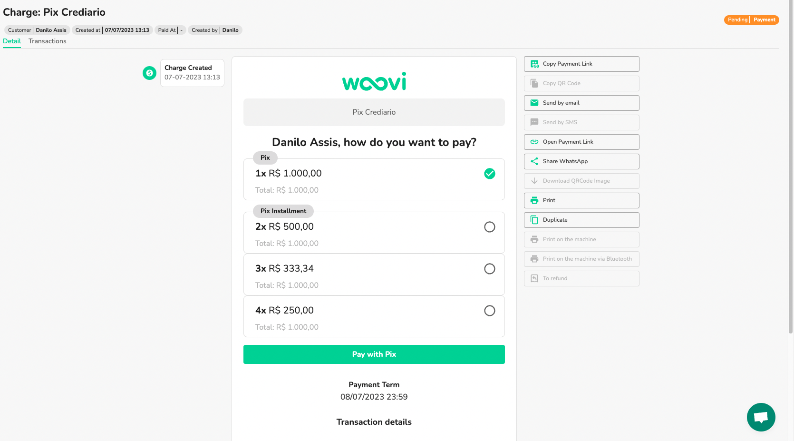
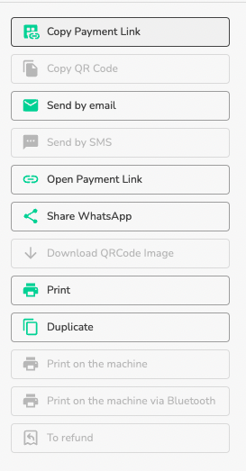
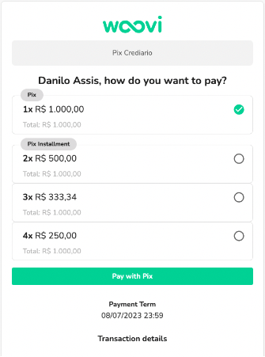
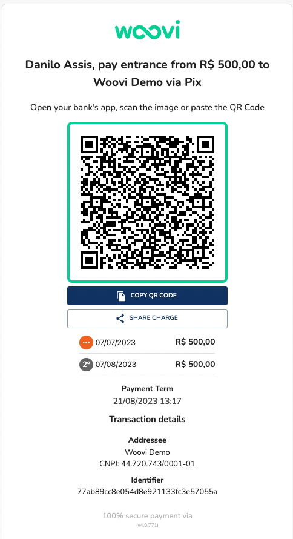
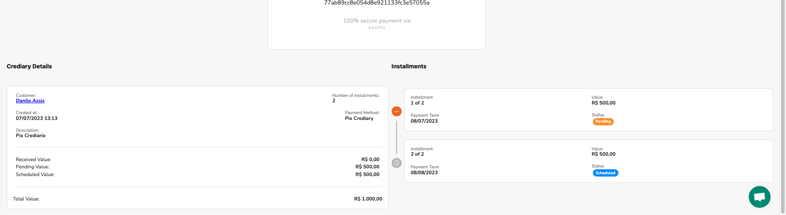

## How does Pix Credit work?
Woovi's Pix Crediário is a digital installment plan management tool. First, the merchant selects or registers the customer, defining the sale value and payment terms. Then a payment link is generated and sent to the customer. He chooses the number of installments and pays the first one. Done, sale complete

- You set the rules
- Flexibility for the Client
- Fast and Practical
- Access for sellers
- Send by email
- Send by WhatsApp
- Credit analysis
- Agreement for Defaulting Customers
- Dashboard and Reports

## How to use Pix Credit
1. Go to the sidebar and select Billing
2. In charges in the upper right corner, click on the Pix Crediário button
   
3. Then fill out the form to create the Pix Credário
   
   1. **Customer to be billed**: It is mandatory to fill in a customer name, CPF/CNPJ, telephone number and email.
   2. **Charge data**: enter the value of Pix Crediário (mandatory) and a description (optional).
   3. **Additional Information**: add additional information to Pix Crediário (optional).
   4. **Installments**: Select the maximum number of installments available for the customer to select at the time of payment. Default 4 installments.
   5. **Time for payment**: time for payment of the first installment. Final pattern of the following day.
   6. **Payment destination**: account that will receive payment for Pix Crediário installments.
4. Fill out the form as you wish and click on **Create Billing**
5. When creating it, you will be redirected to the Pix Crediário detail.
   
6. Once created, it is sent via email to your customer
   
7. You can perform messaging actions within the platform through the existing buttons in the billing detail
   
8. When your customer opens the payment link he can select the desired payment option
   
9. When selecting the option, the QRCode Pix of the first installment will be available along with its information
   
10. When selecting the payment method, you will be able to follow the Pix Crediário installments within the platform detail itself. Just go down the page and follow the installments:
    