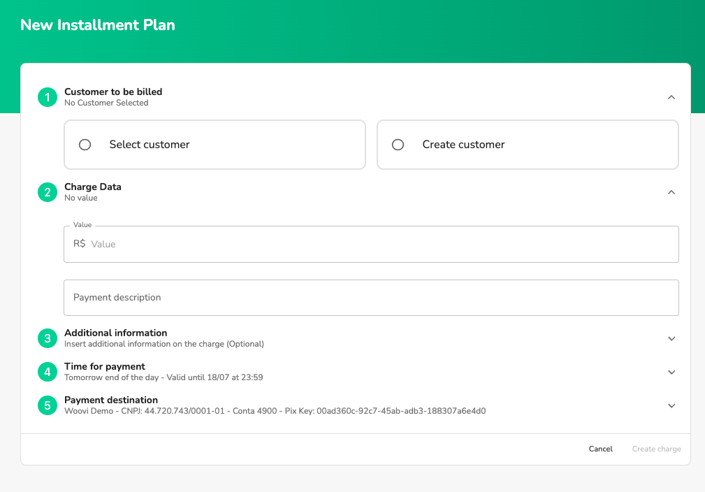
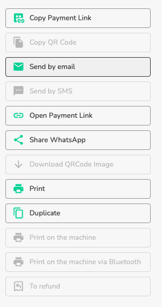
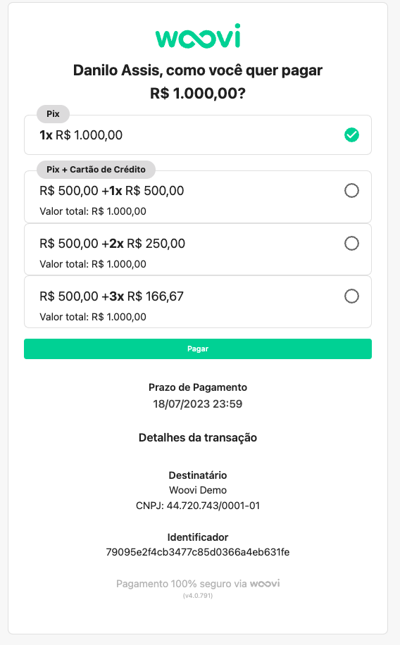

## How does Woovi Parcelado work?
Woovi Parcelado is an innovative payment method that allows your customers to pay a 50% down payment for the Pix and divide the remainder of the purchase up to 4x on the card. The process is completely online, fast and easy, with a native anti-fraud system for total security.

- Increased sales
- Flexibility for the Client
- Fast and Practical
- Access for sellers
- Send by email
- Send by WhatsApp
- Native anti-fraud
- Full receipt within 30 days
- Dashboard and Reports

## How to use Woovi Parcelado
1. Go to the sidebar and select Billing
2. Under charges in the upper right corner click on the Woovi Parcelado button
   
3. Then fill out the form to create Woovi in installments
   
    1. **Customer to be charged**: It is mandatory to fill in a customer name, CPF/CNPJ, telephone number and email.
    2. **Billing data**: enter the Woovi Installment amount (mandatory) and a description (optional).
    3. **Additional Information**: add additional information to Woovi Parcelado (optional).
    4. **Time for payment**: time for payment of the first installment. Final pattern of the following day.
    5. **Destination of payment**: account that will receive payment for Woovi Parcelado installments.
4. Fill out the form as you wish and click on **Create Billing**
5. When creating it, you will be redirected to the Woovi Parcelado detail.
   
6. Once created, it is sent via email to your customer
   
7. You can perform messaging actions within the platform through the existing buttons in the billing detail
   
8. When your customer opens the payment link he can select the desired payment option
   
9. The customer can decide between paying 1x on the pix in cash or 50% of the amount on the pix and the remainder on the credit card.
10. By selecting the cash option, the customer pays the Pix as a normal flow.
11. By selecting an option in installments, the customer fills in the credit card details, woovi authorizes the purchase on the card, generates the qrcode pix and when paying for it, the transaction is captured on the card